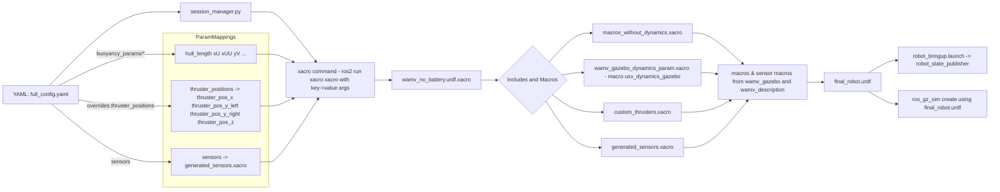

# USV_Simulation - 无人水面航行器仿真平台

[](https://docs.ros.org/en/humble/)
[](https://gazebosim.org/)
[](https://github.com/osrf/vrx)
[](LICENSE)

基于 **ROS 2 + Gazebo Garden + VRX** 的无人水面航行器（USV）高保真度仿真平台，专为WAM-V等水面无人船的研发、测试和竞赛训练而设计。

## 📚 文档导航

为了更好地理解和使用本项目，请按以下顺序阅读相关文档：

- 🚀 **[快速入门指南](QUICK_START.md)** - 5分钟快速体验
- 🏗️ **[技术架构详解](src/usv_sim_full/README.md)** - 核心功能包深度解析  
- 🛠️ **当前文档** - 项目整体介绍和使用概览

## 🎯 项目简介

这是一个完整的无人水面航行器仿真解决方案，集成了：

- **物理仿真引擎**：基于Gazebo Garden的高精度海洋环境模拟
- **机器人控制系统**：支持WAM-V标准船型的双推进器控制
- **传感器套件**：激光雷达、摄像头、IMU、GPS等主流传感器模拟
- **VRX竞赛支持**：兼容海上机器人竞赛标准环境和任务

## 📦 核心组件包

### 主控功能包
```
usv_sim_full/           # 仿真系统主控包
├── launch/             # 系统启动协调器
├── config/             # YAML配置管理系统  
├── scripts/            # 会话管理器和控制器
└── templates/          # URDF机器人模板
```

### VRX竞赛框架包
```
vrx_gz/                 # Gazebo插件和世界模型
├── worlds/             # VRX标准竞赛场景
├── models/             # 竞赛专用模型库
└── plugins/            # 自定义Gazebo插件

vrx_gazebo/             # Gazebo经典版本支持
└── urdf/               # VRX机器人URDF定义

vrx_ros/                # ROS接口和消息定义
├── msgs/               # 自定义ROS消息类型
└── nodes/              # VRX专用ROS节点
```

### 机器人描述包
```
wamv_description/       # WAM-V船体几何描述
├── models/             # 船体3D模型和网格文件
└── urdf/               # 基础URDF组件定义

wamv_gazebo/            # WAM-V Gazebo仿真接口
├── urdf/               # Gazebo增强的URDF定义
└── launch/             # WAM-V专用启动文件
```

## 🚀 快速开始

### 环境准备

```bash
# 1. 安装ROS 2 Humble
sudo apt update && sudo apt install ros-humble-desktop

# 2. 安装Gazebo和VRX依赖
sudo apt install ros-humble-gazebo-ros-pkgs ros-humble-rviz-visual-tools
sudo apt install ros-humble-ros-gz

# 3. 安装构建工具
sudo apt install python3-colcon-common-extensions python3-rosdep
```

### 构建和运行

```bash
# 构建所有包
cd /home/cczh/USV_ROS
colcon build --packages-up-to usv_sim_full

# 源设置环境
source install/setup.bash

# 启动仿真系统
ros2 launch usv_sim_full main.launch.py config_path:='./src/usv_sim_full/config/full_config.yaml'
```

## 🎮 核心功能演示

### 双推进器控制
- **键盘控制**：WASD控制左侧推进器，方向键控制右侧推进器
- **急停功能**：空格键一键停止所有动作
- **实时反馈**：推进器状态和机器人位姿实时显示

### 传感器数据流
```
激光雷达 → /sensors/lidar/front/points
摄像头   → /sensors/camera/front/image_raw  
IMU     → /sensors/imu/data
GPS     → /sensors/gps/data
里程计   → /model/wamv/odometry
```

### VRX竞赛环境
支持标准VRX竞赛场景：
- `sydney_regatta` - 悉尼帆船比赛场地
- `wayfinding_task` - 导航任务场景
- `perception_task` - 感知任务场景

## 🏗️ 系统架构

```
┌─────────────────┐    ┌──────────────────┐    ┌─────────────────┐
│   用户配置      │    │   会话管理器     │    │   Gazebo仿真    │
│  (YAML文件)     │───▶│ (动态配置生成)   │───▶│   (物理引擎)    │
└─────────────────┘    └──────────────────┘    └─────────────────┘
         │                       │                       │
         ▼                       ▼                       ▼
┌─────────────────┐    ┌──────────────────┐    ┌─────────────────┐
│   ROS 2节点     │◀──▶│  传感器桥接      │◀──▶│   传感器模型    │
│ (控制/可视化)   │    │ (Topic转发)      │    │ (LiDAR/Camera)  │
└─────────────────┘    └──────────────────┘    └─────────────────┘
```

## 🔧 配置示例

### 基础配置 (full_config.yaml)
```yaml
robot:
  thruster_config: "H"           # 标准双后推配置
  overrides:
    mass: 180.0                  # 船体质量(kg)
    inertia: [100, 100, 200]     # 转动惯量[kg·m²]
  
  sensors:
    lidars:
      - name: "front_lidar"
        enabled: true
        xyz: [1.0, 0.0, 1.5]     # 前置安装位置

simulation:
  world_name: "sydney_regatta"   # VRX竞赛环境
  obstacles:
    fixed:
      - type: "buoy_red"
        position: [15.0, 8.0, 0.0]
```

### 自定义传感器
```yaml
robot:
  sensors:
    custom_sensors:
      - name: "sonar_array"
        type: "multibeam_sonar"
        enabled: true
        xyz: [0.0, 0.0, -0.5]    # 水下安装
        parameters:
          beam_count: 64
          max_range: 50.0
```

## 📊 开发资源

### API文档
- [usv_sim_full包详细说明](src/usv_sim_full/README.md) - 核心功能包架构和扩展指南
- [VRX框架文档](https://github.com/osrf/vrx) - 官方VRX竞赛框架说明
- [Gazebo Garden手册](https://gazebosim.org/docs/garden/) - 仿真引擎官方文档



### 扩展示例
```python
# 自定义控制器扩展
from usv_sim_full.scripts.session_manager import SessionManager

class AdvancedController(SessionManager):
    def __init__(self):
        super().__init__()
        self.add_control_algorithm("pid_controller")
    
    def process_sensor_data(self, sensor_data):
        # 实现高级控制逻辑
        return control_commands
```

## 🐛 常见问题

### 环境配置问题
```bash
# Q: Gazebo资源路径找不到？
export GZ_SIM_RESOURCE_PATH="/home/cczh/USV_ROS/install/wamv_description/share/wamv_description/models:$GZ_SIM_RESOURCE_PATH"

# Q: ROS包依赖缺失？
rosdep install --from-paths src --ignore-src -r -y
```

### 运行时问题
```bash
# Q: 传感器数据不更新？
ros2 topic list | grep sensors  # 检查话题是否存在
ros2 node list                  # 检查节点状态

# Q: 控制响应延迟？
ros2 param get /robot_state_publisher use_sim_time  # 检查仿真时间同步
```

## 🤝 贡献参与

### 开发流程
1. Fork项目并创建功能分支
2. 参考[开发指南](src/usv_sim_full/README.md#开发指南)进行扩展开发
3. 提交Pull Request并关联相关Issue

### 社区交流
- 📧 邮件列表：usv-simulation@googlegroups.com
- 💬 Discord：加入VRX竞赛社区讨论
- 🐛 Issues：在GitHub上报告bug和功能需求

## 📄 许可证

本项目采用Apache 2.0许可证，VRX相关组件遵循各自上游项目的许可证条款。

## 🙏 致谢

特别感谢以下开源项目和社区的支持：

- [VRX项目](https://github.com/osrf/vrx) - 海上机器人竞赛框架
- [Gazebo Simulator](https://gazebosim.org/) - 物理仿真引擎
- [ROS 2项目](https://www.ros.org/) - 机器人操作系统
- [WAM-V项目](https://github.com/osrf/vrx) - 标准水面无人船平台

---
*Made with ❤️ for autonomous marine robotics research and education*