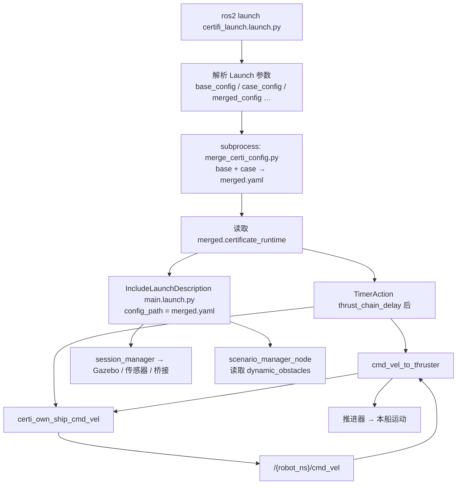

# 认证会遇仿真（certifi_launch）

**入口**：`ros2 launch usv_sim_full certifi_launch.launch.py`

`certifi_launch.launch.py` 是船级社认证会遇场景的专用 Launch：在启动全量仿真前，将 **认证基底配置** 与 **会遇案例 YAML** 合并为完整 `full_config`，再交给 `main.launch.py`；并额外拉起本船定速定向 `cmd_vel` 链（不依赖 Nav2）。

---

## 1. 启动前

```bash
cd <ws>
source /opt/ros/humble/setup.bash
source install/setup.bash
colcon build --packages-select usv_sim_full --symlink-install   # 修改 launch/配置后
```

---

## 2. 快速启动

```bash
# 默认案例 C1-001（危险对遇）
ros2 launch usv_sim_full certifi_launch.launch.py

# 指定会遇案例
ros2 launch usv_sim_full certifi_launch.launch.py \
  case_config:=src/usv_simulation/usv_sim_full/config/certificate_case/C3-001.yaml

# 仅预合并、不启动仿真（调试用）
python3 src/usv_simulation/usv_sim_full/tools/merge_certi_config.py \
  --case src/usv_simulation/usv_sim_full/config/certificate_case/C1-001.yaml
```

合并产物写入 `usv_sim_full/config/generated/<scenario_id>.merged.yaml`（已 gitignore，勿手改）。

---

## 3. Launch 参数

| 参数 | 默认值 | 说明 |
|------|--------|------|
| `base_config` | `config/certi_senario.yaml` | 认证仿真基底（世界、本船、传感器等） |
| `case_config` | `certificate_case/C1-001.yaml` | 会遇场景 YAML |
| `merged_config` | 空 | 合并输出路径；空则写入 `config/generated/<case_id>.merged.yaml` |
| `robot_namespace` | 空 | 本船 ROS 命名空间；空则从 merged 的 `robot_1.name` 读取 |
| `verbose_launch` | `false` | `true` 时节点输出到终端 |
| `thrust_chain_delay` | `3.0` | spawn 后延时启动本船 `cmd_vel` 链（秒） |

---

## 4. 启动流程

`certifi_launch` 在 `OpaqueFunction(launch_setup)` 中完成配置合并与节点编排，顺序如下。



### 4.1 配置合并（启动前阻塞）

Launch 启动时同步调用 `tools/merge_certi_config.py`：

```bash
python3 merge_certi_config.py --base <certi_senario.yaml> --case <C*.yaml> [--out <path>]
```

合并失败则 Launch 直接报错退出。成功后校验 `certificate_runtime.own_ship_velocity.enabled == true`。

### 4.2 拉起 main.launch.py

通过 `IncludeLaunchDescription` 将 **合并后的 YAML** 作为 `config_path` 传给 `main.launch.py`，由后者完成：

- `session_manager` 生成 URDF、桥接、RViz、障碍布局
- `infra_sim` + 每船 `robot_bringup`（Gazebo、传感器桥接）
- `scenario_manager_node`（动态目标船）
- 可选 RViz、毫米波、海事雷达后处理等

**`main.launch.py` 的完整启动逻辑、参数与节点编排** 见包内文档（docs_v4 当前无独立 main 专题页）：

- [`usv_sim_full/launch/notes.md`](../../usv_sim_full/launch/notes.md) — **主参考**：`main.launch.py` 流程图、Launch 参数、`scenario_manager_node` 与 `robot_bringup` 职责边界
- [`usv_sim_full/README.md`](../../usv_sim_full/README.md) — Launch 入口一览与快速命令
- [`usv_sim_full/config/notes_config.md`](../../usv_sim_full/config/notes_config.md) — YAML 字段与 `session_manager` 数据流

docs_v4 中 [`QUICK_START.md`](QUICK_START.md) §5.1 仅给出 `main.launch.py` 一行启动示例，**不含参数与编排说明**。

### 4.3 本船运动链（认证专用）

默认 **3 秒** 后通过 `TimerAction` 启动（不经过 Nav2）：

| 节点 | 作用 |
|------|------|
| `cmd_vel_to_thruster` | `/{robot_ns}/cmd_vel` → 推进器指令 |
| `certi_own_ship_cmd_vel` | 按 merged 中 `speed_mps`、`course_deg` 定速定向发布 `cmd_vel`；检测到其它 `cmd_vel` 发布者时退让停发 |

参数来源：合并脚本写入的 `certificate_runtime.own_ship_velocity`（由 case 中 `own_ship` 换算）。

---

## 5. 配置联动：基底 + 案例 YAML

### 5.1 文件分层

```
config/certi_senario.yaml          certificate_case/C1-001.yaml
        (基底)                              (会遇语义)
            │                                    │
            └──────── merge_certi_config.py ─────┘
                            │
                            ▼
              config/generated/C1-001.merged.yaml
                            │
              ┌─────────────┴─────────────┐
              ▼                           ▼
      main.launch.py              certifi_launch 本船链
```

| 文件 | 职责 |
|------|------|
| `config/certi_senario.yaml` | 世界 `sydney_regatta_open_water`、单船 `robot_1`（传感器、动力学、spawn）、RViz；`dynamic_obstacles` 为空 |
| `config/certificate_case/C*.yaml` | 会遇语义：本船初速/航向、目标船类型、DCPA/TCPA 等 |
| `config/generated/*.merged.yaml` | 合并产物：完整 `full_config` + `certificate_runtime` |

案例格式与场景索引见 [`config/certificate_case/README.md`](../../usv_sim_full/config/certificate_case/README.md)。

### 5.2 Case YAML → 合并后映射

示例 `C1-001.yaml`：

```yaml
scenario_id: C1-001
description: 危险对遇
own_ship:
  initial_speed_knots: 10.0
  initial_heading_deg: 0.0
target_ships:
- id: TS1
  type: head_on
  is_dangerous: true
  target_tcpa_seconds: 10.0
  speed_knots: 14.0
  encounter_range_max_m: 50.0
  target_dcpa_meters: 5.0
```

| Case 字段 | 合并后写入 | 消费者 |
|-----------|-----------|--------|
| `own_ship.initial_heading_deg` | `robot_1.spawn_pose[5]`（yaw） | `session_manager` spawn 本船 |
| `own_ship.initial_speed_knots` | `certificate_runtime.own_ship_velocity` | `certi_own_ship_cmd_vel` |
| `target_ships[]` | `scenario.dynamic_obstacles[]`（航路点、速度、朝向） | `scenario_manager_node` |
| `target_ships[].spawn_delay_sec` | `dynamic_obstacles[].spawn_delay_sec` | C3 依次会遇，延迟生成 |
| `scenario_id` | `certificate_runtime.case_id` | 日志与校验 |

合并脚本根据会遇类型（`head_on` / `crossing_right` / `crossing_left` / `overtaking` / `overtaken`）和 DCPA/TCPA 计算目标船航路点，并校验相对方位角与 COLREGs 语义。`scenario.ground_truth_sim` 由合并脚本强制 `enabled: false`。

### 5.3 场景类别

| 类别 | 编号 | 特点 |
|------|------|------|
| C1 | C1-001～010 | 单目标船 |
| C2 | C2-001～005 | 危险主目标 + 非危险干扰船 TS2 |
| C3 | C3-001～015 | 两艘危险船**依次**会遇（TS2 `spawn_delay_sec` ≈ 95s） |
| C4 | C4-001～011 | 两艘危险船**同时**会遇 |

41 个案例可由 `tools/generate_certificate_cases.py` 从 `certificate_case/senario_cule.md` 批量生成。

---

## 6. 与全栈 Demo 的关系

| 入口 | 侧重 |
|------|------|
| `certifi_launch.launch.py` | 会遇几何与合规性验证；本船定速 `cmd_vel` 链；简化感知链 |
| `nav2_sim_three_vision_mmwave_bringup.launch.py` | 三视觉 + 毫米波 + 后融合 + Nav2 COLREGs 全栈 |

二者共享 `usv_sim_full` + YAML 配置体系；架构对照见 [`usv_sim_full/docs/nav2_sim_three_vision_mmwave_architecture.md`](../../usv_sim_full/docs/nav2_sim_three_vision_mmwave_architecture.md)。

---

## 7. 常见问题

| 现象 | 处理 |
|------|------|
| `merge_certi_config failed` | 检查 case YAML 语法与会遇参数；单独运行合并脚本查看 stderr |
| `certificate_runtime.own_ship_velocity.enabled must be true` | 合并脚本异常或未正确执行 `apply_certificate_case` |
| 本船不动 | 确认 `thrust_chain_delay` 已过；`ros2 topic echo /{ns}/cmd_vel` |
| 目标船未出现 | 查 merged 中 `scenario.dynamic_obstacles`；`scenario_manager_node` 日志 |
| 需无传感器轻量场景 | `base_config:=.../certi_senario_no_sensors.yaml` |

---

## 8. 相关文档

| 文档 | 说明 |
|------|------|
| [QUICK_START.md](QUICK_START.md) | docs_v4 环境构建与 Demo 入口 |
| [DEMO_RUN.md](DEMO_RUN.md) | 三视觉 + Nav2 全栈参数 |
| [`launch/notes.md`](../../usv_sim_full/launch/notes.md) | **`main.launch.py` 使用说明（主参考）** |
| [`config/notes_config.md`](../../usv_sim_full/config/notes_config.md) | 配置字段与数据流 |
| [`config/certificate_case/README.md`](../../usv_sim_full/config/certificate_case/README.md) | 案例 YAML 格式与索引 |
