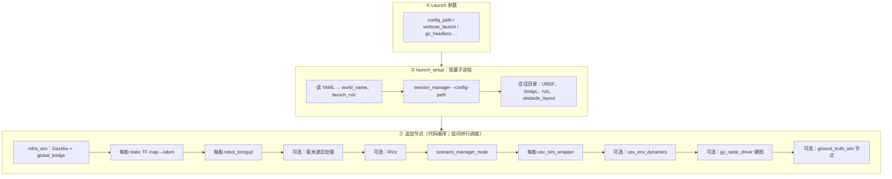

# main.launch 使用说明（docs_v4）

**入口**：`ros2 launch usv_sim_full main.launch.py`

`main.launch.py` 是 `usv_sim_full` 的**唯一全量仿真主入口**：读取一份整机 YAML（`config_path`），经 `session_manager` 生成会话产物，再拉起 Gazebo、多船桥接、传感器后处理、动态场景与可选 RViz。

---

## 0. 导读

读完本文你可以：

- 用默认或自定义 YAML 启动仿真
- 知道**该改哪些文件、不该改哪些产物**
- 理解 launch 启动时的**生成与节点编排顺序**
- 按任务场景（换世界、加传感器、加目标船等）定位配置项

**前置**：环境构建见 [QUICK_START.md](QUICK_START.md)、[BUILD.md](BUILD.md)。

**自建配置包**（复制 YAML、重命名、独立目录）：见 [custom_config.md](custom_config.md)。

---

## 1. 快速启动

```bash
cd <ws>
source /opt/ros/humble/setup.bash
source install/setup.bash

# 默认：share 内 config/full_config.yaml
ros2 launch usv_sim_full main.launch.py

# 指定配置（相对工作区或绝对路径均可）
ros2 launch usv_sim_full main.launch.py \
  config_path:=src/usv_simulation/usv_sim_full/config/mmwave_sydney_minimal.yaml

# 无 GUI（服务器 / CI）
ros2 launch usv_sim_full main.launch.py gz_headless:=true

# 排错：终端详细输出
ros2 launch usv_sim_full main.launch.py verbose_launch:=true
```

**最小验证**：

```bash
ros2 node list | head
ros2 topic list | grep -E 'odom|clock'
```

### 与上层 Launch 的关系

| 上层 Launch | 与 `main.launch.py` 的关系 |
|-------------|---------------------------|
| `nav2_sim_three_vision_mmwave_bringup.launch.py` | Include `main`，默认 `config_path` 指向 `three_vision_one_mmwave/full_config.yaml`；详见 [DEMO_RUN.md](DEMO_RUN.md) |
| `nav2_sim_full_bringup.launch.py` | Include `main`，再延时启动 Nav2 |
| `certifi_launch.launch.py` | 先合并认证 YAML，再以 `config_path` 调用 `main`；详见 [certifi_launch.md](certifi_launch.md) |
| `test_hull.launch.py` | **不**走 `main`，简化水面 + `robot_bringup` |
| `sensor_tune.launch.py` | **不**启 Gazebo，仅 `session_manager` + URDF/RViz 调参 |

---

## 2. Launch 参数速查

命令行覆盖，**不写进** `full_config.yaml`：

| 参数 | 默认 | 何时修改 |
|------|------|----------|
| `config_path` | `share/.../config/full_config.yaml` | 换场景 / 换船配置 |
| `gz_headless` | `false` | 无 GUI 冒烟 |
| `verbose_launch` | `false` | 排错、看 `session_manager` 完整输出 |
| `use_sim_time` | `true` | 极少改 |
| `use_static_map_odom_tf` | `true` | Nav2 联调；EKF 发布 `map→odom` 时可关 |
| `enable_robot_localization` | `false` | 启用 EKF + navsat 融合 |
| `localization_params_file` | `config/robot_localization_gps.yaml` | 改滤波参数 |
| `localization_start_delay` | `5.0` | spawn/桥接慢时加大 |
| `enable_tf_namespace_relay` | `true` | 命名空间 Nav2 用 |
| `rviz_config_path_override` | 空 | 自定义 RViz 底稿（复制到临时文件后再追加显示项） |

---

## 3. 可编辑配置文件地图

### 3.1 按「你想改什么」找文件

| 你想改… | 编辑位置 | 备注 |
|---------|----------|------|
| 默认整机场景 | `config/full_config.yaml` | `main` 默认 `config_path` |
| 三视觉 Demo 整机 | `config/three_vision_one_mmwave/full_config.yaml` | 由 `nav2_sim_three_vision_mmwave_bringup` 传入 |
| 毫米波最小场景 | `config/mmwave_sydney_minimal.yaml` | 常关 RViz，轻量 |
| 认证会遇（合并后） | `config/generated/*.merged.yaml` | **勿手改**；改 `certificate_case` + `certifi_launch` |
| 自建场景包 | `config/<你的目录>/` | 流程见 [custom_config.md](custom_config.md) |
| 字段字典（带注释） | `config/full_config.reference.yaml` | launch **不加载**，仅查阅 |
| 传感器内参 | `sensor_config_path` 指向的文件 | 默认 `config/sensor_config.yaml`；Demo 用 `three_vision_one_mmwave/sensor_config.yaml` |
| Gazebo 世界 | `environment.world_name` | 对应 `worlds/<name>.sdf` 或 `.world` |
| 静态障碍 | `obstacles.fixed_list` | → 会话 `obstacle_layout.json` |
| 动态目标船 / 巡逻障碍 | `scenario.dynamic_obstacles` | `scenario_manager_node` 消费 |
| 周邻 CTRV 真值 | `scenario.ground_truth_sim` | 详见本文附录 A |
| 本船名 / 传感器 / 动力学 | `robot_1`（及 `robot_2`…） | `session_manager` + `robot_bringup` |
| 是否开 RViz | `visualization.launch_rviz` | 或上层 bringup 的 `launch_rviz` |

### 3.2 运行时生成、勿手改

`session_manager` 在会话目录（常见 `/tmp/usv_sim_sessions/...`）写入：

| 产物 | 用途 |
|------|------|
| `source_config.yaml` | 本次 YAML 副本 |
| `sensor_config.yaml` | 内参副本 |
| `bridge_config_<船名>.yaml` | 每船 `ros_gz_bridge` 规则 |
| `session.rviz` | 本会话 RViz |
| `obstacle_layout.json` | 静态障碍，`obstacle_spawner` 使用 |
| 合并 URDF | `robot_bringup` spawn |

**规则**：改源 YAML → 重启 launch；不要改会话目录内文件。

### 3.3 Launch 直读、一般不改

| 文件 | 消费者 |
|------|--------|
| `config/global_bridge.yaml` | `infra_sim`（全局 `/clock` 等） |
| `config/robot_localization_gps.yaml` | `enable_robot_localization:=true` 时 |

更完整的文件—消费者对照见 [`config/notes_config.md`](../../usv_sim_full/config/notes_config.md)。

---

## 4. `full_config.yaml` 常用字段

完整字段说明见 [`config/full_config.reference.yaml`](../../usv_sim_full/config/full_config.reference.yaml)。下表覆盖日常 80% 用法。

### 4.1 顶层块

| 块 | 常用键 | 作用 | 主要消费者 |
|----|--------|------|------------|
| `environment` | `world_name` | Gazebo 世界名 | `infra_sim`、`scenario_manager_node` |
| `sensor_config_path` | 相对本 YAML 的路径 | 传感器内参文件 | `session_manager`、毫米波默认参数 |
| `obstacles` | `fixed_list[]` | 静态浮标/障碍 | `session_manager` → `obstacle_spawner` |
| `scenario` | `dynamic_obstacles[]`、`ground_truth_sim` | 动态场景 / 周邻真值 | `scenario_manager_node`、真值节点 |
| `visualization` | `launch_rviz`、`enable_telemetry` | RViz 与遥测桥接 | `main.launch.py` |
| `robot_N` | `name`、`spawn_pose`、`sensors` 等 | 第 N 艘船 | `session_manager` → `robot_bringup` |

### 4.2 `robot_1` 常用字段

| 字段 | 说明 |
|------|------|
| `name` | ROS 命名空间，如 `usv_1` → 话题 `/{name}/...` |
| `spawn_pose` | `[x, y, z, roll, pitch, yaw]`，单位 m / rad |
| `xacro_template` | 船体 URDF 模板 |
| `sensors[]` | 传感器列表：`lidar`、`camera`、`imu`、`gps`、`maritime_radar`、`mmwave_radar` 等 |
| `enable_env_dynamics` | 是否启 `usv_env_dynamics`（风/流） |
| `env_dynamics` | `k_wind`、`k_current` 等 |
| `overrides.ground_truth_enabled` | URDF 内 Gazebo P3D 真值里程计（≠ `scenario.ground_truth_sim`） |

传感器 `override_topic`：**不含船名前缀**；最终话题为 `/{robot.name}` + 路径（如 `/sensors/lidar/front_lidar/points`）。

### 4.3 `scenario.dynamic_obstacles[]` 常用字段

| 字段 | 说明 |
|------|------|
| `name` | 障碍名（运行时多为 `dyn_<name>`） |
| `shape` | `cylinder` / `box` / `mesh_profile` |
| `waypoints` | `[[x,y], ...]`，至少 2 点才有运动 |
| `speed` | 沿航路标量速度 (m/s) |
| `loop` | 是否往返循环 |
| `spawn_delay_sec` | 延迟生成（秒） |
| `spawn_heading_deg` | 可选，船首朝向 |
| `mesh_profile` | `shape=mesh_profile` 时必填，路径相对本 `full_config` |

### 4.4 多船

- 顶层键须为 `robot_1`、`robot_2`、…（数字升序）。
- **首船**（`robot_1`）负责 `obstacle_spawner`；后续船错开 `create_entity_delay` spawn。

---

## 5. 启动与生成逻辑

### 5.1 总览



### 5.2 阶段一：`session_manager`（launch 启动时同步执行）

```bash
ros2 run usv_sim_full session_manager --config-path <config_path>
```

- 解析 `full_config` + `sensor_config_path` 指向的内参
- 生成每船 URDF、桥接 YAML、RViz、静态障碍布局
- stdout 末尾输出 JSON（`rviz_config_path`、`obstacle_layout_path`、船列表等）
- `verbose_launch:=false` 时终端仅一行摘要；排错时用 `verbose_launch:=true`

可单独调试：

```bash
ros2 run usv_sim_full session_manager \
  --config-path src/usv_simulation/usv_sim_full/config/full_config.yaml --verbose
```

### 5.3 阶段二：节点编排要点

| 顺序 | 组件 | 职责 |
|------|------|------|
| 1 | `infra_sim` | 设资源路径，启 Gazebo 世界 + `global_bridge.yaml` |
| 2 | `static_transform_publisher` | 每船 `map → {robot}/odom`（`use_static_map_odom_tf`） |
| 3 | `robot_bringup` × N | **本船**：spawn、传感器桥、海事雷达桥（按配置）、odom/TF |
| 4 | 毫米波节点 | `mmwave_4d_cloud_node`、`mmwave_cluster_node`（按船按传感器） |
| 5 | `visualization` | 可选 RViz |
| 6 | `scenario_manager_node` | **仅读** `scenario.dynamic_obstacles` |
| 7 | `usv_sim_wrapper` × N | 汇总状态话题 |
| 8 | `usv_env_dynamics` | 按船 `enable_env_dynamics` |
| 9 | `gy_radar_driver` | 海事雷达扇区 → 点云/栅格（按船） |
| 10 | `ground_truth_sim` 相关 | 按 `scenario.ground_truth_sim`（附录 A） |

### 5.4 职责边界（易混淆点）

| 组件 | 读什么 | 做什么 |
|------|--------|--------|
| `robot_bringup` | session 产物 + 本船 `robot_N` | **本船** Gazebo 实体与传感器桥接 |
| `scenario_manager_node` | `scenario.dynamic_obstacles` | **场景里的动态障碍/目标船**（航路点驱动） |
| `session_manager` | 整份 `config_path` | 启动前一次性生成，非常驻节点 |

`robot_bringup` 与 `scenario_manager_node` **不抢同一套参数**：前者管 ego，后者管 `dynamic_obstacles`。

---

## 6. 典型使用场景

每个场景：**改什么 → 怎么启动 → 验证什么**。

### 6.1 换海域

1. 改 `environment.world_name`（确认 `usv_sim_full/worlds/` 有对应 `.sdf`/`.world`）
2. `ros2 launch usv_sim_full main.launch.py config_path:=<你的 yaml>`
3. Gazebo 窗口 / `gz topic -l` 确认世界加载

### 6.2 加/减传感器

1. 改 `robot_1.sensors` 列表
2. 必要时改 `sensor_config_path` 指向的内参 YAML
3. 重启 launch；`ros2 topic list | grep usv_1`

### 6.3 加静态障碍

1. 在 `obstacles.fixed_list` 增加项（`name`、`type`、`pose`、`color` 等）
2. 重启；首船 `obstacle_spawner` 写入 Gazebo

### 6.4 加一艘巡逻目标船

1. 在 `scenario.dynamic_obstacles` 增加航路点条目（见 §4.3）
2. 重启；查 `scenario_manager_node` 日志与 Gazebo 实体树 `dyn_*`

### 6.5 关 RViz / 无 GUI

- 关 RViz：YAML 中 `visualization.launch_rviz: false`
- 无 GUI：`gz_headless:=true`

### 6.6 对接 Nav2 全栈

`main.launch.py` 只负责仿真侧。Nav2 + 感知全栈请用：

```bash
ros2 launch usv_sim_full nav2_sim_three_vision_mmwave_bringup.launch.py
```

参数与验证见 [DEMO_RUN.md](DEMO_RUN.md)。架构见 [`nav2_sim_three_vision_mmwave_architecture.md`](../../usv_sim_full/docs/nav2_sim_three_vision_mmwave_architecture.md)。

### 6.7 认证会遇场景

不直接改 `full_config`，而用 `certifi_launch` 合并 `certi_senario.yaml` + `certificate_case/*.yaml`：

```bash
ros2 launch usv_sim_full certifi_launch.launch.py \
  case_config:=src/usv_simulation/usv_sim_full/config/certificate_case/C1-001.yaml
```

详见 [certifi_launch.md](certifi_launch.md)。

### 6.8 自建配置目录

复制现有 YAML 到新目录、改相对路径后用 `config_path:=` 启动 — 完整步骤见 [custom_config.md](custom_config.md)。

---

## 7. 话题、命名空间与 TF

- 船名 `robot_1.name`（如 `usv_1`）→ 话题前缀 `/{name}/`
- 常用验证（以 `usv_1` 为例）：

```bash
ros2 topic echo /usv_1/odom --once
ros2 topic echo /usv_1/sensors/lidar/front_lidar/points --qos-reliability best_effort
ros2 topic echo /usv_1/sensors/mmwave/mmwave_front/points --qos-reliability best_effort
```

- `use_static_map_odom_tf:=true` 时为每船发布静态 `map → {robot}/odom`，与 RViz Fixed Frame=`map` 配套
- 仿真 TF 总览：[docs/sim_tf_tree.md](../../../../docs/sim_tf_tree.md)

**周邻真值 RViz**：勾选 Marker 命名空间 `target_pose` / `target_path` / `target_history`（勿只启用空命名空间）。

---

## 8. 常见问题

| 现象 | 处理 |
|------|------|
| 世界找不到 | 检查 `world_name` 与 `worlds/` 文件名 |
| 改 YAML 不生效 | 重启 launch；勿改会话目录；`symlink-install` 后改源码树即生效 |
| 船无传感器话题 | 查 `sensors` 列表与会话 `bridge_config_*.yaml` |
| Nav2 报 `map` / TF 超时 | 确认 `use_static_map_odom_tf`；仿真时钟下静态 TF 须 `use_sim_time`；Nav2 bringup 加大 `nav2_start_delay` |
| `merge` / session 失败 | `verbose_launch:=true` 或单独跑 `session_manager --verbose` |
| gz `Host unreachable` | 单实例仿真；`unset GZ_IP IGN_IP`；同 `ROS_DOMAIN_ID` |

---

## 9. 相关文档

| 文档 | 何时读 |
|------|--------|
| [QUICK_START.md](QUICK_START.md) | 环境构建 |
| [custom_config.md](custom_config.md) | 复制 YAML 自建场景包 |
| [DEMO_RUN.md](DEMO_RUN.md) | Nav2 全栈 Demo |
| [certifi_launch.md](certifi_launch.md) | 认证会遇 |
| [`full_config.reference.yaml`](../../usv_sim_full/config/full_config.reference.yaml) | 字段字典 |
| [`config/notes_config.md`](../../usv_sim_full/config/notes_config.md) | 配置维护者向 |
| [`launch/notes.md`](../../usv_sim_full/launch/notes.md) | 开发向 launch 全览 |

---

## 附录 A. 传感器分层与 `ground_truth_sim`（延伸阅读）

正文不展开实现细节；需要时读下列文档。

### A.1 海事雷达 vs 毫米波（为何拆在 bringup 与 main）

二者在 `full_config` 的 `sensors[]` 中同级，但管线长度不同：

| 传感器 | Gz / 桥接层（`robot_bringup`） | 后处理（`main.launch.py`） |
|--------|-------------------------------|---------------------------|
| 海事雷达 | `radar_gz_bridge`：spokes → ROS 扇区 | `gy_radar_driver` / `radar_controller`：扇区 → 点云 / OccupancyGrid |
| 毫米波 | `parameter_bridge`：`gpu_ray` 点云 | `mmwave_4d_cloud_node`、`mmwave_cluster_node`（`usv_mmwave_sim`） |

设计原则：**bringup = 实体 + 通用桥；main = 会话编排 + 可选重型后处理**。开发向说明见 [`launch/notes.md` §海事雷达 vs 毫米波](../../usv_sim_full/launch/notes.md)。

**待补齐**：docs_v4 暂无海事雷达 / 毫米波独立用户指南；可参考 [`usv_sim_full/README.md`](../../usv_sim_full/README.md) 话题示例与 [`nav2_sim_three_vision_mmwave_architecture.md`](../../usv_sim_full/docs/nav2_sim_three_vision_mmwave_architecture.md)。

### A.2 `scenario.ground_truth_sim`

| 键 | 常用含义 |
|----|----------|
| `enabled` | 启动周邻目标真值节点 |
| `gazebo_visual` | `true` 时在 Gazebo 生成实体并由 pose 回灌真值 |
| `reference_robot` | 环带采样圆心参考船 |
| `target_count` / `annulus_*` | CTRV 随机目标数量与环带（`motion_mode=ctrv`） |
| `motion_mode: waypoint` + `fixed_targets[]` | 固定航路点目标（Demo 常用） |
| `fence_*` | 围栏越界移除目标 |

与 `robot_1.overrides.ground_truth_enabled`（URDF P3D）**不是同一机制**。

**实现文档**：

- [`ground_truth_sim/PACKAGE_README.md`](../../ground_truth_sim/PACKAGE_README.md)
- [`ground_truth_sim/README.md`](../../ground_truth_sim/README.md)
- Launch 备忘：[`launch/notes.md` §ground_truth_sim](../../usv_sim_full/launch/notes.md)
- 隔离测试：`ros2 launch usv_sim_full ground_truth_test.launch.py`（默认 `config/full_config.yaml`）

### A.3 预设配置包对照

| 配置 | 典型用途 | 启动方式 |
|------|----------|----------|
| `config/full_config.yaml` | 默认整机 | `main.launch.py` |
| `config/mmwave_sydney_minimal.yaml` | 毫米波最小场景 | `main.launch.py config_path:=...` |
| `config/three_vision_one_mmwave/` | 三视觉 Demo | `nav2_sim_three_vision_mmwave_bringup.launch.py` |
| `config/ground_truth_*.yaml` | 真值 / 航路点测试 | `main.launch.py config_path:=...` |
| `certi_senario.yaml` + `certificate_case/` | 认证会遇 | `certifi_launch.launch.py` |

自建新包流程见 [custom_config.md](custom_config.md)。
