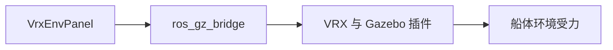

# 功能包架构

本包提供 RViz 插件，不提供独立 ROS 节点。

```mermaid
flowchart LR
    PANEL[VrxEnvPanel] --> BRIDGE[ros_gz_bridge]
    BRIDGE --> PLUGINS[VRX 与 Gazebo 插件]
    PLUGINS --> DYNAMICS[船体环境受力]
```

面板负责参数输入和发布；风、水流、波浪和光照的仿真计算由 Gazebo 插件负责。

- `VrxEnvPanel`：发布环境控制参数。
- `DynamicShipPanel`：发布目标船配置。
- `StormFieldPanel` 和 `StormPointTool`：发布风暴场配置和中心点。
