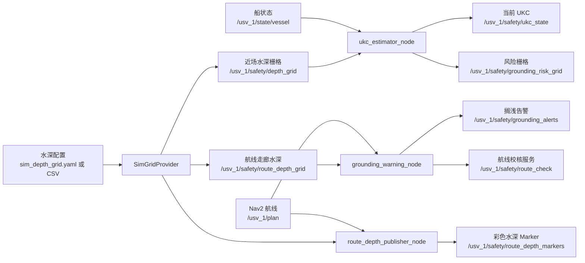

# 搁浅预警功能说明书（仿真实现）

版本：v1.3  
日期：2026-08-12  
适用范围：USV_ROS `humble-ccs-ukc` 分支  
关联文档：[使用说明](./USAGE.md)、[接口说明](./INTERFACES.md)

## 这份文档给谁看

给第一次接触这段代码的人。读之前不需要了解电子海图，也不需要知道搁浅预警的行业背景。文档先讲清楚“这个功能到底在做什么”，再讲代码里有什么、数据怎么走、计算怎么算。看完前四节，你应该能回答三个问题：

1. 这个包解决什么问题？
2. 一条航线从输入到告警，中间经过哪些节点？
3. 想接自己的模块，该订阅哪些话题、调用哪个服务？

## 1. 这个功能解决什么问题

仿真里有一条船，Nav2 会规划出一条航线（一串目标点连成的路径）。如果航线经过浅水区，船可能会搁浅。这个包要做的事，是提前告诉你“哪里会不够深”。

它具体做四件事：

- 读入一张仿真水深图，把船周围（默认 500 m × 500 m）切成小方格，算出每个格子的水深；
- 在当前船位算一次“船底离海底还剩多少米”；
- 沿着 Nav2 的航线每隔一小段取一个点，在**那个点的位置**再算一次“船底离海底还剩多少米”，找到第一个不够深的点，发出告警；
- 对任意一条航线做校核，返回第一个危险点和最小富余水深。

“船底离海底的距离”具体是这样算的：在某个位置，用水深矩阵里该点的水深加上当时的水位，得到水面到海底的深度；再减去船当时的动态吃水，剩下的就是船底到海底的距离。航线上每个点都要算一次，因为不同位置的水深不一样。如果水位随时间变化，每个点还要用到达那个点时刻的水位（仿真里默认水位恒定）。

先解释几个后面会反复出现的词：

| 词 | 意思 |
|----|------|
| 水深栅格 | 把一片水域切成小方格，每个格子里写一个水深值 |
| 吃水 | 船沉进水里的深度，单位米 |
| UKC | 船底到海底的垂直距离，也叫富余水深 |
| squat（下蹲） | 船开起来以后船体会下沉一点，吃水变大 |
| 航线（Path） | Nav2 给的一条路径，由一串点组成 |
| 足迹 | 船体在水平面上占的范围，计算时不能只看船中心一个点 |

## 2. 整体流程（一句话版）

```text
读水深 → 算当前位置的 UKC → 沿航线逐个点算 UKC
→ 找到第一个危险点 → 发告警 / 校核航线 → 画出来给你看
```

## 3. 数据流图



图里带 `/usv_1/` 的都是 ROS 话题。订阅它们就能拿到结果；具体字段见接口说明。

## 4. 代码里有什么

代码放在三个包里：

| 包 | 作用 |
|----|------|
| `enc_grounding_warning_msgs` | 定义对外传输的数据格式（消息和服务） |
| `enc_grounding_warning` | 核心逻辑：读水深、算 UKC、发告警、校核航线 |
| `enc_grounding_warning_rviz` | RViz 面板，把 UKC、风险、告警显示在界面上 |

核心逻辑包里一共有四个节点，每个节点只做一件事：

| 节点 | 做的事 |
|------|--------|
| `depth_provider_node` | 把水深配置读进内存，发布船附近的水深栅格 |
| `ukc_estimator_node` | 用船的位置和速度，算当前船位的 UKC 和风险 |
| `grounding_warning_node` | 订阅 Nav2 航线，沿航线找危险点，发告警，提供校核服务 |
| `route_depth_publisher_node` | 把航线周围的水深画成彩色小方块，方便在 RViz 里看 |

另外还有几个辅助入口：

| 入口 | 用途 |
|------|------|
| `generate_depth_grid` | 从 YAML 配置生成 CSV 水深矩阵 |
| `publish_test_plan` | 不启动 Nav2 也能发一条测试航线 |
| `integration_test` | 自动跑一遍完整闭环，验证节点有没有接错 |
| `pytest` | 12 项单元测试 |

## 5. 数据从哪里来

所有水深数据都从一份 YAML 配置进入系统，默认文件是 `config/sim_depth_grid.yaml`。

支持两种来源：

1. `mode: flat`：用代码生成水深。可以设一个基础水深，加正弦起伏，再叠几个圆形浅点。
2. `mode: file`：从 CSV 文件读水深矩阵。CSV 是 row-major 排列，`-9999` 表示没有数据。

水深矩阵的范围由 `origin_x`、`origin_y`、`resolution`、`width`、`height` 决定。读进来之后，每个格子还会带上不确定度和质量等级；仿真默认是 `0.1 m` 和 `CATZOC B`（CATZOC 是海图数据质量等级，B 可以理解为中等精度）。

### 5.1 最终的水深数据是什么格式

`sim_depth_grid.yaml` 里的 `depth_m`、`undulation`、`shoals`，以及 CSV 文件，都只是**原料**。程序读进来之后，会先合成一张二维水深矩阵，存在内存里；后面所有计算（当前 UKC、航线前瞻、航线校核）查的都是这张矩阵。

这张矩阵对外发布时使用 `DepthGrid` 消息，包含：

```text
origin_x / origin_y      # 矩阵左下角在 map 系里的坐标
resolution               # 每个格子的边长，单位米
width / height           # 横向和纵向有多少个格子
depth_m                  # 每个格子的水深，一维数组，row-major
uncertainty_m            # 每个格子的不确定度
quality                  # 每个格子的质量等级
flags                    # 每个格子的标志（陆地/干出/无数据等）
```

也就是说，后面说的“水深”，默认指这张矩阵里某个格子的 `depth_m`。

## 6. 核心计算逻辑

### 6.1 水深栅格怎么生成

这一步把第 5 节说的“原料”合成最终矩阵。先解释配置里两个词：

- `undulation`：给水深加一点高低起伏，模拟海床不是平的。配置里有 `amplitude_m`（起伏幅度）、`wavelength_m`（起伏波长）、`direction_deg`（起伏方向）。
- `shoals`：浅点，可以理解成地图上的圆形浅滩。每个浅点用四个数描述：

```yaml
- {x: 300.0, y: 250.0, radius: 50.0, depth_m: 0.5}
```

意思是：以 `(300, 250)` 为圆心、半径 50 米的圆形区域里，水深最浅 0.5 米。

`mode: flat` 时，程序按下面的顺序生成最终矩阵：

1. 先给每个格子填上基础水深 `depth_m`。比如配置里 `depth_m: 3.0`，那这一步所有格子都是 3.0 米。
2. 如果 `undulation.enabled: true`，按每个格子的坐标算一个正弦值，加到这个格子的水深上。这一步之后，格子水深会变成 2.5、3.2、3.8 之类，不再是统一的一个数。
3. 接着处理 `shoals`。程序会一个接一个地检查每个浅点；对每个浅点，再检查整张矩阵里的所有格子：如果“浅点圆心到格子中心的距离 ≤ 浅点的 radius”，说明这个格子被浅点覆盖。被覆盖的格子，水深改成“当前值”和“该浅点的 depth_m”里更小的那个。
4. 多个浅点重叠时，第 3 步会重复执行，最后保留的值一定是这几个浅点里最浅的。

`mode: file` 时，上面 1~3 步全部跳过，直接把 CSV 读成最终矩阵，CSV 里的值就是水深。

举一个具体例子：某个格子当前水深 3.0 米，它同时被两个浅点覆盖，一个浅点是 0.5 米，另一个是 0.8 米。经过第 3 步后，这个格子会先变成 0.5 米，再和 0.8 米比较，仍然是 0.5 米。取最浅值就是“保留所有来源里最小的那个”，宁可按浅的算，也不按深的算。

`-9999` 或没有数据的格子标记为未知，不会被当成安全区。

`depth_provider_node` 发布的近场栅格、`route_depth_publisher_node` 发布的航线走廊栅格，都是从这张最终矩阵里“裁”一块出来，不会重新取最浅值。

### 6.2 UKC 怎么算

```text
可用水深    = 水深矩阵里的水深 + 水位
动态吃水    = 静吃水 + squat + 横倾 + 纵倾 + 波浪
UKC        = 可用水深 - 动态吃水
```

其中 squat 用简化公式估算，速度越快下沉越多：

```text
开阔浅水：Squat = Cb * V² / 100
受限航道：Squat = Cb * V² / 50
```

`V` 是船速（节），`Cb` 是方形系数，一个描述船体肥瘦的系数。

系统还会算一个“至少需要多少水深”：

```text
所需安全水深 = 动态吃水 + 所需 UKC 余量 + 不确定度 - 水位
```

### 6.3 风险怎么分级

拿到 UKC 之后，代码按下面的顺序判断（见 `ukc_model.classify`）：

```text
1. 没有水深数据                → 255 未知
2. ukc <= 0                    → 4 搁浅
3. h_avail / 静吃水 < 1.1      → 3 危险
4. ukc >= ukc_req + u_total + margin_safe → 0 安全
5. ukc >= ukc_req + u_total    → 1 注意
6. ukc >= ukc_req              → 2 警告
7. 其余情况                    → 3 危险
```

公式里的两个量是这样算的：

```text
ukc_req = max(ukc_required_abs_m, ukc_required_pct * T_dyn)
u_total = safety_factor * sqrt(u_depth² + u_tide² + u_draft² + u_squat² + u_wave²)
```

对应默认值（来自 `grounding_warning_params.yaml`）：

| 参数 | 默认值 |
|------|--------|
| `ukc_required_abs_m` | 0.3 |
| `ukc_required_pct` | 0.10 |
| `safety_factor` | 1.0 |
| `u_depth_m` | 0.1 |
| `u_tide_m` | 0.0 |
| `u_draft_m` | 0.02 |
| `u_squat_m` | 0.02 |
| `u_wave_m` | 0.0 |
| `margin_safe_m` | 0.1 |

换成一句话：安全线是 `ukc_req + u_total + 0.1`，低于 `ukc_req` 就危险，`ukc <= 0` 就搁浅。

为了避免告警抖来抖去，`ukc_estimator_node` 里还有防抖和迟滞：

- 连续 `debounce_count` 次（默认 3）风险达到“警告”以上才触发；
- 解除告警要求风险回到“注意”以下，并且 `ukc >= ukc_req + u_total + margin_safe + hysteresis`，其中 `hysteresis_m` 默认 0.1。

### 6.4 航线前瞻怎么做

沿航线每隔一小段取一个点，每个点用“船体足迹”覆盖的所有格子里的最浅水深来算 UKC。找到第一个风险达到“警告”的点，就输出：

- 距离危险点还有多远；
- 按当前速度还要多久到；
- 危险点的坐标。

每个点用的都是**那个位置**的水深，并且按**到达那个点的时刻**取水位（仿真默认水位恒定，所以目前时间项不会改变结果）。

没有航线时，就按当前航向和速度往前直线外推一段。

收到新的 `/usv_1/plan` 后，`grounding_warning_node`、`route_depth_publisher_node`
和 `ukc_estimator_node` 会在 `plan_immediate_min_interval_s`（默认 0.2 秒）的
限流条件下立即计算并发布一次，避免每次都等定时器；周期发布仍然保留，作为兜底。

告警按时间分三级：

```text
距危险点 > 600 秒   → INFO
120 ~ 600 秒        → WARNING
< 120 秒            → CRITICAL
```

## 7. 对外接口

结果主要通过这些话题发布：

| 话题 | 内容 |
|------|------|
| `/usv_1/safety/depth_grid` | 船附近的水深栅格 |
| `/usv_1/safety/ukc_state` | 当前 UKC 和风险 |
| `/usv_1/safety/grounding_risk_grid` | 风险栅格 |
| `/usv_1/safety/grounding_alerts` | 搁浅告警 |
| `/usv_1/safety/route_depth_grid` | 航线走廊水深栅格 |
| `/usv_1/safety/route_depth_markers` | 航线走廊彩色 Marker |

航线校核走服务：

```text
/usv_1/safety/route_check
输入：一条航线（nav_msgs/Path）
输出：首个危险点、最小 UKC、航线水深剖面
```

每个消息的字段和枚举值，见[接口说明](./INTERFACES.md)。

## 8. 主要配置

所有参数都在 `config/grounding_warning_params.yaml` 的 `ukc:` 下面。新手只需要先认识这几个：

| 参数 | 默认值 | 含义 |
|------|--------|------|
| `static_draft_m` | 0.5 | 船的静吃水 |
| `length_m` / `beam_m` | 4.9 / 2.0 | 船长和船宽 |
| `block_coefficient` | 0.55 | 方形系数，算 squat 用 |
| `ukc_required_abs_m` | 0.3 | 最少留多少米余量 |
| `water_level_m` | 0.0 | 当前水位 |
| `lookahead_time_s` | 300 | 往前看多久 |
| `lookahead_distance_m` | 1000 | 往前看多远 |
| `sample_ds_m` | 2.0 | 航线上每隔几米取一个点 |

水深本身的配置在 `config/sim_depth_grid.yaml`，参数含义见第 5 节。

## 9. 怎么运行

```bash
# 1. 构建
colcon build --packages-select \
  enc_grounding_warning_msgs enc_grounding_warning enc_grounding_warning_rviz \
  --symlink-install

# 2. 只想验证逻辑，不启动仿真
ros2 launch enc_grounding_warning enc_grounding_warning.launch.py use_sim_time:=false
ros2 run enc_grounding_warning integration_test

# 3. 想跑完整仿真 + Nav2 + RViz
ros2 launch enc_grounding_warning full_sim_with_grounding_warning.launch.py
```

每一步的详细说明见[使用说明](./USAGE.md)。

## 10. 已知限制

- 当前只读仿真水深矩阵，还没有接真实电子海图（S-57/S-101）；
- squat 用的是经验公式，对浅吃水的小艇不一定准，最好用实测数据标定；
- 航线采样太稀或足迹设得太小，可能漏掉很窄的浅点；
- 完整仿真依赖 `usv_sim_full` 和 Nav2 全部构建完成。
