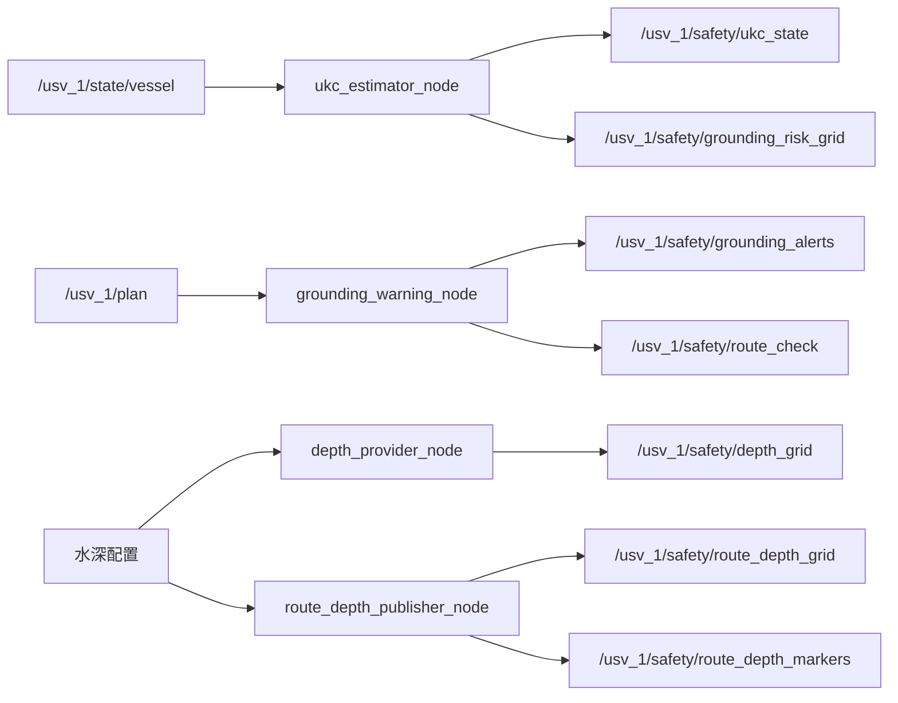

# USV Safety 接口说明

本文说明搁浅预警功能对外提供的消息、服务、话题和输入依赖，便于其他模块快速接入。

---

## 1. 总览



默认命名空间：`usv_1`。

---

## 2. 对外话题

| Topic | 类型 | 方向 | 说明 |
|-------|------|------|------|
| `/usv_1/safety/depth_grid` | `DepthGrid` | 发布 | 船体附近稠密水深栅格 |
| `/usv_1/safety/ukc_state` | `UKCState` | 发布 | 当前船位 UKC 与风险 |
| `/usv_1/safety/grounding_risk_grid` | `GroundingRiskGrid` | 发布 | 本船附近风险栅格 |
| `/usv_1/safety/grounding_alerts` | `GroundingAlert` | 发布 | 搁浅报警（变化时发布） |
| `/usv_1/safety/route_depth_grid` | `DepthGrid` | 发布 | 航线走廊水深栅格 |
| `/usv_1/safety/route_depth_markers` | `MarkerArray` | 发布 | 航线走廊彩色水深 Marker |
| `/usv_1/safety/grounding_markers` | `MarkerArray` | 发布 | 航线风险点/首个危险点 |
| `/usv_1/safety/current_risk_marker` | `MarkerArray` | 发布 | 当前船位风险球 + UKC 文字 |
| `/usv_1/safety/route_check` | `RouteCheck`（服务） | 请求/响应 | 航线校核 |

## 3. 输入依赖

| 输入 | 类型 | 说明 |
|------|------|------|
| `/usv_1/state/vessel` | `usv_interfaces/VesselState` | 本船位置/速度/姿态 |
| `/usv_1/plan` | `nav_msgs/Path` | Nav2 全局路径 |
| TF `map -> usv_1/base_link` | `tf2_msgs/TFMessage` | 船位坐标变换 |

TF 不可用时，节点会回退使用 `VesselState.pose`（假设 map/odom 一致），
保证仿真默认场景可用。

---

## 4. 消息定义

### 4.1 `DepthGrid`

```text
std_msgs/Header header
float64 origin_x          # map 系左下角 X
float64 origin_y          # map 系左下角 Y
float32 resolution        # m/cell
int32 width
int32 height
float32[] depth_m         # row-major，-9999=未知
float32[] uncertainty_m
uint8[] quality           # 0=UNKNOWN 1=A1 2=A2 3=B 4=C 5=D 6=U
uint8[] flags             # 1=LAND 2=DRYING 4=NO_DATA 8=HAZARD_UNKNOWN_DEPTH
```

栅格索引：

```text
index = y_index * width + x_index
x = origin_x + (x_index + 0.5) * resolution
y = origin_y + (y_index + 0.5) * resolution
```

### 4.2 `UKCState`

```text
std_msgs/Header header
float32 chart_depth_m
float32 water_level_m
float32 available_depth_m
float32 static_draft_m
float32 squat_m
float32 heel_allowance_m
float32 trim_allowance_m
float32 wave_allowance_m
float32 dynamic_draft_m
float32 ukc_m
float32 ukc_required_m
float32 uncertainty_m
float32 safety_depth_m
uint8 risk_level
```

核心公式：

```text
available_depth = chart_depth + water_level
dynamic_draft  = static_draft + squat + heel + trim + wave
ukc            = available_depth - dynamic_draft
safety_depth   = dynamic_draft + ukc_required + uncertainty - water_level
```

### 4.3 `GroundingAlert`

```text
std_msgs/Header header
uint8 level               # 1=INFO 2=WARNING 3=CRITICAL
uint8 type                # 1=CURRENT 2=LOOKAHEAD 3=ROUTE
float32 min_ukc_m
float32 ukc_required_m
float32 distance_to_danger_m
float32 time_to_danger_s
float64 danger_x
float64 danger_y
uint32 route_index
string description
```

### 4.4 `GroundingRiskGrid`

```text
std_msgs/Header header
float64 origin_x
float64 origin_y
float32 resolution
int32 width
int32 height
int8[] risk
```

### 4.5 `RouteDepthProfile`

```text
std_msgs/Header header
string route_id
float32 corridor_half_width_m
float32[] distance_m
float32[] depth_min_m
float32[] ukc_m
float32[] uncertainty_m
uint8[] risk
uint32[] route_index
```

### 4.6 `RouteCheck.srv`

```text
nav_msgs/Path route
---
bool success
RouteDepthProfile profile
int32 first_unsafe_index  # -1 表示无危险
float64 danger_x
float64 danger_y
float32 min_ukc_m
float32 time_to_danger_s
string message
```

---

## 5. 枚举语义

### 5.1 `risk_level`

| 值 | 含义 |
|----|------|
| 0 | SAFE |
| 1 | CAUTION |
| 2 | WARNING |
| 3 | DANGER |
| 4 | GROUNDED |
| 255 | UNKNOWN |

### 5.2 `GroundingAlert.level`

| 值 | 含义 |
|----|------|
| 1 | INFO |
| 2 | WARNING |
| 3 | CRITICAL |

### 5.3 `GroundingAlert.type`

| 值 | 含义 |
|----|------|
| 1 | CURRENT（当前船位） |
| 2 | LOOKAHEAD（前方航路） |
| 3 | ROUTE（航线校核） |

### 5.4 `DepthGrid.quality`

| 值 | 含义 |
|----|------|
| 0 | UNKNOWN |
| 1 | CATZOC A1 |
| 2 | CATZOC A2 |
| 3 | CATZOC B |
| 4 | CATZOC C |
| 5 | CATZOC D |
| 6 | CATZOC U |

### 5.5 `DepthGrid.flags`

| 位 | 含义 |
|----|------|
| 1 | LAND |
| 2 | DRYING |
| 4 | NO_DATA |
| 8 | HAZARD_UNKNOWN_DEPTH |

---

## 6. 其他模块接入示例

### 6.1 订阅 UKC 状态

```python
from enc_grounding_warning_msgs.msg import UKCState

self.create_subscription(
    UKCState,
    "/usv_1/safety/ukc_state",
    callback,
    10,
)
```

### 6.2 订阅搁浅告警

```python
from enc_grounding_warning_msgs.msg import GroundingAlert

self.create_subscription(
    GroundingAlert,
    "/usv_1/safety/grounding_alerts",
    callback,
    10,
)
```

### 6.3 调用航线校核服务

```bash
ros2 service call /usv_1/safety/route_check enc_grounding_warning_msgs/srv/RouteCheck \
"{route: {header: {frame_id: 'map'}, poses: [{header: {frame_id: 'map'}, pose: {position: {x: 200.0, y: 200.0}, orientation: {w: 1.0}}}, {header: {frame_id: 'map'}, pose: {position: {x: 400.0, y: 300.0}, orientation: {w: 1.0}}}]}}"
```

### 6.4 RViz 面板

```text
Panels -> Add New Panel -> enc_grounding_warning_rviz/GroundingWarningPanel
```

面板支持修改 Namespace，默认 `usv_1`。
