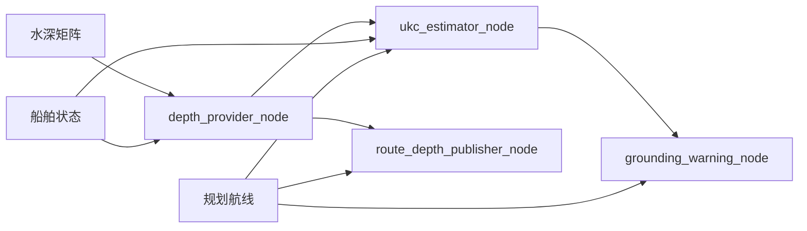

# 功能包架构

本包由四个 ROS 2 节点组成。

```mermaid
flowchart LR
    DEPTH[水深矩阵] --> PROVIDER[depth_provider_node]
    STATE[船舶状态] --> PROVIDER
    PROVIDER --> UKC[ukc_estimator_node]
    STATE --> UKC
    PLAN[规划航线] --> UKC
    UKC --> WARNING[grounding_warning_node]
    PLAN --> WARNING
    PROVIDER --> ROUTE[route_depth_publisher_node]
    PLAN --> ROUTE
```

- `depth_provider_node`：发布船体附近水深栅格。
- `ukc_estimator_node`：计算龙骨下净空和风险状态。
- `grounding_warning_node`：发布告警并提供航线校核服务。
- `route_depth_publisher_node`：发布航线走廊水深栅格和 Marker。
