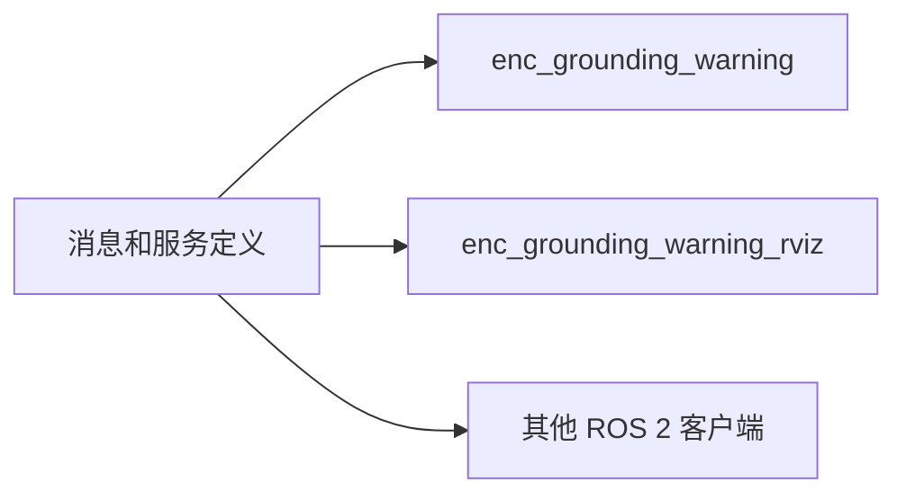

# 功能包架构

本包只包含 ROS 2 接口定义，不包含运行节点。

```mermaid
flowchart LR
    MSG[消息和服务定义] --> WARNING[enc_grounding_warning]
    MSG --> RVIZ[enc_grounding_warning_rviz]
    MSG --> CLIENT[其他 ROS 2 客户端]
```

接口文件位于 `msg/` 和 `srv/` 目录，由 ROS 接口生成工具在构建时生成语言绑定。
