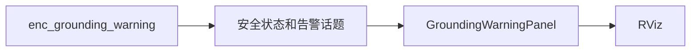

# 功能包架构

`GroundingWarningPanel` 是 RViz 插件，不提供独立 ROS 节点。

```mermaid
flowchart LR
    WARNING[enc_grounding_warning] --> TOPICS[安全状态和告警话题]
    TOPICS --> PANEL[GroundingWarningPanel]
    PANEL --> RVIZ[RViz]
```

面板可设置要订阅的船舶命名空间，默认值为 `usv_1`。
