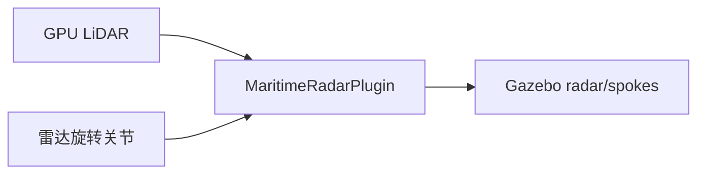

# 功能包架构

`MaritimeRadarPlugin` 作为 Gazebo 系统插件加载到带旋转天线和 GPU 激光雷达的模型中。

```mermaid
flowchart LR
    LIDAR[GPU LiDAR] --> PLUGIN[MaritimeRadarPlugin]
    JOINT[雷达旋转关节] --> PLUGIN
    PLUGIN --> SPOKES[Gazebo radar/spokes]
```

插件参数由模型 SDF 提供，包括输入激光雷达话题、输出雷达话题、距离范围和分辨率。
