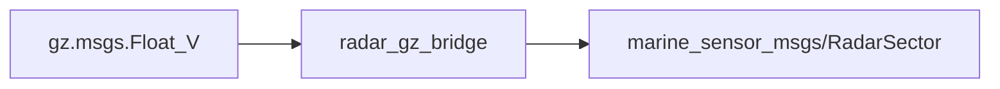

# 功能包架构

`radar_gz_bridge` 是一个 C++ ROS 2 节点，订阅 Gazebo Transport 话题并发布 ROS 2 雷达扇区。

```mermaid
flowchart LR
    GZ[gz.msgs.Float_V] --> NODE[radar_gz_bridge]
    NODE --> ROS[marine_sensor_msgs/RadarSector]
```

启动参数或 `config/radar_bridge.yaml` 用于设置 Gazebo 输入话题、ROS 输出话题、坐标系和量程。
