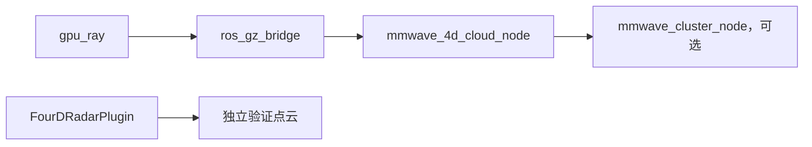

# 功能包架构

本包包含两条链路：完整仿真的点云后处理链路，以及用于独立验证的 Gazebo 插件。

```mermaid
flowchart LR
    RAY[gpu_ray] --> BRIDGE[ros_gz_bridge]
    BRIDGE --> CLOUD[mmwave_4d_cloud_node]
    CLOUD --> CLUSTER[mmwave_cluster_node，可选]
    PLUGIN[FourDRadarPlugin] --> TEST[独立验证点云]
```

- `mmwave_4d_cloud_node`：补充多普勒速度和雷达散射截面字段。
- `mmwave_cluster_node`：对点云聚类并输出目标列表。
- `FourDRadarPlugin`：用于独立验证，不是完整仿真的默认链路。
