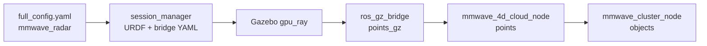

# usv_mmwave_sim × usv_sim_full 集成指南

本文说明如何在 [`usv_sim_full`](../../../usv_sim_full/) 整机仿真中接入毫米波雷达仿真能力。默认路径为 **URDF `gpu_ray` + ROS 后处理**，不依赖 `FourDRadarPlugin`。

---

## 0. 推荐集成路径（整机主链路）



| 阶段 | 负责组件 | 说明 |
|------|----------|------|
| 配置 | `full_config.yaml` + `sensor_config.yaml` | 声明传感器与内参 |
| URDF / 桥接 | `session_manager` | 生成 `gpu_ray` 与 `parameter_bridge` YAML |
| Gazebo 探测 | `mmwave_radar_macro`（`gpu_ray`） | 仅输出几何点云（x,y,z） |
| ROS 桥接 | `robot_bringup` → `parameter_bridge` | Gz `…/points` → ROS `…/points_gz` |
| 4D 增强 | `mmwave_4d_cloud_node` | 补 `doppler_velocity`、`rcs` 等 |
| 聚类（可选） | `mmwave_cluster_node` | DBSCAN → `MmwaveTargetArray` |

**整机主链路不需要** 设置 `GZ_SIM_SYSTEM_PLUGIN_PATH`（`gpu_ray` 为 Gazebo 内置传感器）。

---

## 1. 配置层引用路径

### 1.1 船体与传感器（`full_config.yaml`）

在 `robot_N.sensors` 中增加毫米波条目（`override_topic` **不含船名前缀**）：

```yaml
robot_1:
  name: usv_1
  sensors:
    - name: mmwave_front
      type: mmwave_radar
      parent_link: base_link
      xyz: [0.0, 0.0, 1.9]
      rpy: [0.0, 0.0, 0.0]
      override_topic: /sensors/mmwave/mmwave_front/points
      enabled: true
```

参考文件：

- 完整多船示例：[`usv_sim_full/config/full_config.yaml`](../../../usv_sim_full/config/full_config.yaml)

### 1.2 传感器内参（`sensor_config.yaml`）

路径由 `full_config` 顶栏 `sensor_config_path` 指定（默认同目录 `config/sensor_config.yaml`）。

关键段落：`mmwave.default`（FOV、量程、RCS、海杂波、测量误差、`output_use_reliable_qos` 等）。

文件：[`usv_sim_full/config/sensor_config.yaml`](../../../usv_sim_full/config/sensor_config.yaml)

### 1.3 URDF 生成

[`session_manager.py`](../../../usv_sim_full/usv_sim_full/scripts/session_manager.py) 在 `generate_sensors_overlay` 中为 `mmwave_radar` / `mmwave` 类型插入 xacro 宏。

URDF 宏定义：[`usv_sim_full/description/urdf/sensor_macros.xacro`](../../../usv_sim_full/description/urdf/sensor_macros.xacro) → `mmwave_radar_macro`（内部为 `type="gpu_ray"`）。

注释约定：4D 字段由 ROS 侧 `mmwave_4d_cloud_node` 生成，不在 Gazebo 插件内完成。

### 1.4 桥接规则

同文件 `generate_bridge_config`：

- 毫米波 bridge 目标话题为 `…/points_gz`（最终 `…/points` 留给 `mmwave_4d_cloud_node` 发布）
- 消息类型：`sensor_msgs/PointCloud2` ↔ `gz.msgs.PointCloudPacked`

### 1.5 Launch 辅助函数

[`launch_config_helpers.py`](../../../usv_sim_full/usv_sim_full/launch_config_helpers.py)：

| 函数 | 用途 |
|------|------|
| `load_mmwave_sensor_defaults()` | 读 `sensor_config.yaml` → `mmwave.default` |
| `mmwave_bridge_topics(sensor, sanitized_ns)` | 计算 `input_topic`（points_gz）与 `output_topic`（points） |
| `build_mmwave_4d_cloud_parameters()` | 组装 `mmwave_4d_cloud_node` 参数字典 |

---

## 2. 话题命名约定

以船名 `usv_1`、传感器名 `mmwave_front`、`override_topic: /sensors/mmwave/mmwave_front/points` 为例：

| 阶段 | 话题 | 消息类型 |
|------|------|----------|
| Gazebo 发布 | `/usv_1/sensors/mmwave/mmwave_front/points` | gz PointCloudPacked |
| bridge 中间（ROS） | `/usv_1/sensors/mmwave/mmwave_front/points_gz` | `sensor_msgs/PointCloud2`（仅 x,y,z） |
| 4D 最终点云 | `/usv_1/sensors/mmwave/mmwave_front/points` | `PointCloud2`（含 `doppler_velocity`、`rcs`） |
| 聚类目标（建议） | `/usv_1/sensors/mmwave/mmwave_front/objects` | `usv_interfaces/MmwaveTargetArray` |
| RViz markers（建议，待迁入） | `/usv_1/sensors/mmwave/mmwave_front/markers` | `visualization_msgs/MarkerArray` |

船名前缀由 `session_manager` / `mmwave_bridge_topics()` 根据 `robot_N.name` 自动添加；YAML 里只写传感器相对路径。

---

## 3. 依赖与构建

### 3.1 包依赖

- `usv_sim_full/package.xml` 已声明 `<depend>usv_mmwave_sim</depend>`
- `usv_mmwave_sim` 依赖 `usv_interfaces`（`MmwaveTargetArray` 等）

### 3.2 构建命令

```bash
cd <ws>   # 工作区根目录（包含 src/ 的 colcon 工作区）
colcon build --packages-up-to usv_sim_full --symlink-install
source install/setup.bash
```

或最小集：

```bash
colcon build --packages-select usv_interfaces usv_mmwave_sim usv_sim_full --symlink-install
source install/setup.bash
```

---

## 4. Launch 集成（设计 vs 现状）

### 4.1 设计目标

[`usv_sim_full/launch/main.launch.py`](../../../usv_sim_full/launch/main.launch.py) 与 [`launch/notes.md`](../../../usv_sim_full/launch/notes.md) 约定：

1. 扫描 `full_config` 中所有 enabled 的 `mmwave_radar` / `mmwave` 传感器；
2. 对每个「船 × 毫米波」启动 `usv_mmwave_sim::mmwave_4d_cloud_node`，参数来自 `build_mmwave_4d_cloud_parameters()`；
3. 同循环内启动 `mmwave_cluster_node`，`input_topic` 指向 4D `points`，`output_topic` 为 `…/objects`。

`robot_bringup` 负责 spawn、桥接；毫米波 ROS 后处理放在 `main` 层，与海事雷达 `gy_radar_driver` 编排方式一致。

### 4.2 Launch 自动启动（已实现）

当 `full_config` 中存在 enabled 的 `mmwave_radar` / `mmwave` 传感器时，[`main.launch.py`](../../../usv_sim_full/launch/main.launch.py) 会按 **船 × 传感器** 自动启动：

1. `usv_mmwave_sim::mmwave_4d_cloud_node`（`points_gz` → `points`）
2. `usv_mmwave_sim::mmwave_cluster_node`（`points` → `objects`）

聚类参数默认来自 [`sensor_config.yaml`](../../../usv_sim_full/config/sensor_config.yaml) 的 `mmwave.cluster`；话题由 `mmwave_bridge_topics()` / `mmwave_cluster_topics()` 推导。

无需再手动 `ros2 run` 上述节点（除非调试单节点）。

### 4.3 手动单节点调试（可选）

若需单独重启某一环节，仍可使用：

```bash
source install/setup.bash
ros2 run usv_mmwave_sim mmwave_4d_cloud_node --ros-args \
  -p input_topic:=/usv_1/sensors/mmwave/mmwave_front/points_gz \
  -p output_topic:=/usv_1/sensors/mmwave/mmwave_front/points \
  -p odom_topic:=/usv_1/odom \
  -p use_sim_time:=true \
  -p world_frame:=map \
  -p base_rcs:=12.0 \
  -p rcs_distance_decay:=0.01 \
  -p perception_range_limit_m:=300.0 \
  -p enable_sea_clutter:=false \
  -p output_use_reliable_qos:=true
```

内参亦可从 `sensor_config.yaml` 的 `mmwave.default` 对齐；上表为常用默认值。

**终端 3**（可选）— 点云聚类：

```bash
source install/setup.bash
ros2 run usv_mmwave_sim mmwave_cluster_node --ros-args \
  -p input_topic:=/usv_1/sensors/mmwave/mmwave_front/points \
  -p output_topic:=/usv_1/sensors/mmwave/mmwave_front/objects \
  -p radar_id:=mmwave_front \
  -p cluster_eps_m:=4.0 \
  -p cluster_min_points:=3 \
  -p min_rcs:=2.0 \
  -p max_range_m:=300.0 \
  -p output_use_reliable_qos:=true
```

或加载包内默认参数并覆盖话题：

```bash
source install/setup.bash
ros2 run usv_mmwave_sim mmwave_cluster_node --ros-args \
  --params-file $(ros2 pkg prefix usv_mmwave_sim)/share/usv_mmwave_sim/config/mmwave_cluster.yaml \
  -p input_topic:=/usv_1/sensors/mmwave/mmwave_front/points \
  -p output_topic:=/usv_1/sensors/mmwave/mmwave_front/objects \
  -p radar_id:=mmwave_front
```

> **注意**：`config/mmwave_cluster.yaml` 默认 `input_topic: /radar/points_4d` 面向 FourDRadarPlugin 验证场景；整机必须改为上文的 `…/points`。

后续 launch 恢复/集成将把上述参数写入 `main.launch.py`，话题与 `mmwave_bridge_topics()` 自动对齐。

---

## 5. 聚类与可视化（可选后处理）

### 5.1 mmwave_cluster_node

- **输入**：必须含字段 `x`, `y`, `z`, `doppler_velocity`, `rcs` 的 `PointCloud2`
- **正确上游**：`mmwave_4d_cloud_node` 的 `…/points`
- **错误上游**：`…/points_gz`（仅几何点，cluster 会报 field error）
- **输出**：`usv_interfaces/msg/MmwaveTargetArray`

源码：[`src/mmwave_cluster_node.cpp`](../src/mmwave_cluster_node.cpp)  
默认参数：[`config/mmwave_cluster.yaml`](../config/mmwave_cluster.yaml)

### 5.2 mmw_objects_markers（计划迁入）

正式包**尚未安装** `mmw_objects_markers` 节点（备份见 `usv_mmwave_sim (back_try)/scripts/mmw_objects_markers.py`）。

迁入后建议订阅 cluster 的 `objects` 话题，发布 `MarkerArray` 到同传感器下的 `markers` 话题，供 RViz 显示包围盒与 L/W/H 标注。

---

## 6. Legacy：FourDRadarPlugin 独立验证

与整机 **二选一**。整机已走 `gpu_ray` 主链路时，**无需**加载 `libusv_4d_radar_plugin.so`。

### 6.1 适用场景

- 插件算法开发与对照实验
- 不依赖 `usv_sim_full` URDF 的独立 SDF world
- 在已运行世界中临时 spawn 探测体

### 6.2 插件搜索路径（必须）

```bash
export GZ_SIM_SYSTEM_PLUGIN_PATH=$(ros2 pkg prefix usv_mmwave_sim)/lib:$GZ_SIM_SYSTEM_PLUGIN_PATH
```

建议在顶层 launch 中用 `SetEnvironmentVariable` 设置；[`spawn_ego_mmwave_validation.launch.py`](../launch/spawn_ego_mmwave_validation.launch.py) 已包含此逻辑。

### 6.3 在已运行世界中 spawn 探测体

```bash
source install/setup.bash
export GZ_SIM_SYSTEM_PLUGIN_PATH=$(ros2 pkg prefix usv_mmwave_sim)/lib:$GZ_SIM_SYSTEM_PLUGIN_PATH
ros2 launch usv_mmwave_sim spawn_ego_mmwave_validation.launch.py \
  world:=sydney_regatta_open_water \
  topic:=/mmwave_spawn_test/points \
  spawn_name:=mmwave_spawn_test
```

验证：

```bash
ros2 topic echo /mmwave_spawn_test/points --once
```

插件直接发布五字段点云；此时 `mmwave_cluster_node` 可订阅该话题（无需 `mmwave_4d_cloud_node`）。

### 6.4 SDF 挂载示例（自建模型）

插件放在 `<model>` 下（勿放在未定义的 `<link>` 下）：

```xml
<plugin filename="libusv_4d_radar_plugin.so" name="usv_4d_radar_gz::FourDRadarPlugin">
  <topic>/radar/points_4d</topic>
  <frame_id>radar_link</frame_id>
  <sensor_link_name>radar_link</sensor_link_name>
  <ego_link_name>base_link</ego_link_name>
  <output_in_sensor_frame>true</output_in_sensor_frame>
  <horizontal_fov_deg>100.0</horizontal_fov_deg>
  <vertical_fov_deg>30.0</vertical_fov_deg>
  <azimuth_resolution_deg>1.0</azimuth_resolution_deg>
  <elevation_resolution_deg>1.0</elevation_resolution_deg>
  <min_range>0.8</min_range>
  <max_range>120.0</max_range>
  <perception_range_limit_m>300.0</perception_range_limit_m>
  <update_rate_hz>10.0</update_rate_hz>
  <base_rcs>12.0</base_rcs>
  <rcs_distance_decay>0.01</rcs_distance_decay>
  <enable_sea_clutter>false</enable_sea_clutter>
</plugin>
```

### 6.5 TF 建议

- 点云 `header.frame_id` 与 `frame_id` 参数一致（如 `radar_link`）
- `output_in_sensor_frame=true` 时，点为雷达局部坐标
- 保证 TF 树中 `base_link → radar_link` 可达

---

## 7. 验证清单

### 7.1 整机最小场景

```bash
source install/setup.bash

# 1) 启动仿真（已自动起 mmwave_4d_cloud_node + mmwave_cluster_node）
ros2 launch usv_sim_full main.launch.py \
  config_path:=$(ros2 pkg prefix usv_sim_full)/share/usv_sim_full/config/full_config.yaml

# 2) 确认点云与聚类目标
ros2 topic hz /usv_1/sensors/mmwave/mmwave_front/points_gz
ros2 topic hz /usv_1/sensors/mmwave/mmwave_front/points
ros2 topic echo /usv_1/sensors/mmwave/mmwave_front/objects --once
ros2 topic info /usv_1/sensors/mmwave/mmwave_front/points -v

# 3) 节点进程
ros2 node list | grep mmwave
```

期望：`points` 话题 fields 含 `doppler_velocity`、`rcs`；`objects` 为 `MmwaveTargetArray`。

### 7.2 插件路径自检

```bash
source install/setup.bash
export GZ_SIM_SYSTEM_PLUGIN_PATH=$(ros2 pkg prefix usv_mmwave_sim)/lib:$GZ_SIM_SYSTEM_PLUGIN_PATH
ros2 launch usv_mmwave_sim spawn_ego_mmwave_validation.launch.py world:=sydney_regatta_open_water
ros2 topic list | grep mmwave
ros2 topic echo /mmwave_spawn_test/points --once
```

---

## 8. 常见问题

| 现象 | 可能原因 | 处理 |
|------|----------|------|
| `points_gz` 有数据，`points` 无 | `mmwave_4d_cloud_node` 未启动或话题错误 | 按 §4.3 手动启动并核对 `input_topic` / `output_topic` |
| cluster 报 PointCloud2 field error | 订阅了 `points_gz` 而非五字段 `points` | 改 `input_topic` 为 4d_cloud 输出 |
| RViz 看不到点云 | QoS 不匹配、Fixed Frame 错误、无 `map→odom` TF | 设 `output_use_reliable_qos:=true`；Fixed Frame 用 `map`；确认 static TF |
| 与海事雷达混淆 | `maritime_radar` 走另一套插件/桥 | 见 `gz_maritime_radar_plugin`、`radar_gz_bridge` |
| `libusv_4d_radar_plugin.so` 找不到 | 未设 `GZ_SIM_SYSTEM_PLUGIN_PATH` | 仅插件路径需要；整机 gpu_ray 不需要 |
| 船名/话题不对 | `full_config` 用 `robot_1` 但 launch 读 `robot:` | 多船配置需恢复 `resolve_session_robots` 版 main.launch |

---

## 9. 与其它仿真方式对比

| 方式 | 入口 | 物理仿真 | 典型输出 |
|------|------|----------|----------|
| **本指南主链路** | `usv_sim_full` + gpu_ray | 有（Gazebo 射线） | 4D `PointCloud2` → 可选 `MmwaveTargetArray` |
| **FourDRadarPlugin** | 本包插件 + 验证 launch | 有（插件射线） | 直接 4D `PointCloud2` |
| **mmw_radar sim_publish** | `ros2 launch mmw_radar sim_publish.launch.py` | 无 | 合成协议级话题 |
| **ground_truth_sensor_sim** | `ground_truth_sim` launch | 无（真值驱动） | 直接 `MmwaveTargetArray` |

整机 Gazebo 仿真请优先使用本指南 **§0 主链路**。

---

## 10. 相关文件索引

| 文件 | 说明 |
|------|------|
| [`../README.md`](../README.md) | 包级概览 |
| [`../package.xml`](../package.xml) | 包元数据与依赖 |
| [`../CMakeLists.txt`](../CMakeLists.txt) | 构建与安装 |
| [`../../../usv_sim_full/launch/main.launch.py`](../../../usv_sim_full/launch/main.launch.py) | 整机主入口（毫米波节点待恢复） |
| [`../../../usv_sim_full/launch/components/robot_bringup.launch.py`](../../../usv_sim_full/launch/components/robot_bringup.launch.py) | 桥接与 spawn |
| [`../../../usv_interfaces/msg/MmwaveTargetArray.msg`](../../../../usv_interfaces/msg/MmwaveTargetArray.msg) | 聚类输出消息 |
