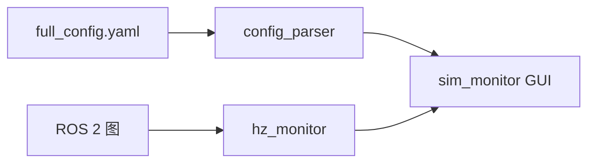

# 功能包架构

`sim_monitor` 为 PyQt 图形界面程序。

```mermaid
flowchart LR
    CFG[full_config.yaml] --> PARSER[config_parser]
    PARSER --> GUI[sim_monitor GUI]
    ROS[ROS 2 图] --> MONITOR[hz_monitor]
    MONITOR --> GUI
```

配置解析器从仿真 YAML 读取预期节点和话题；监视器检查当前 ROS 图并将结果显示在界面中。
