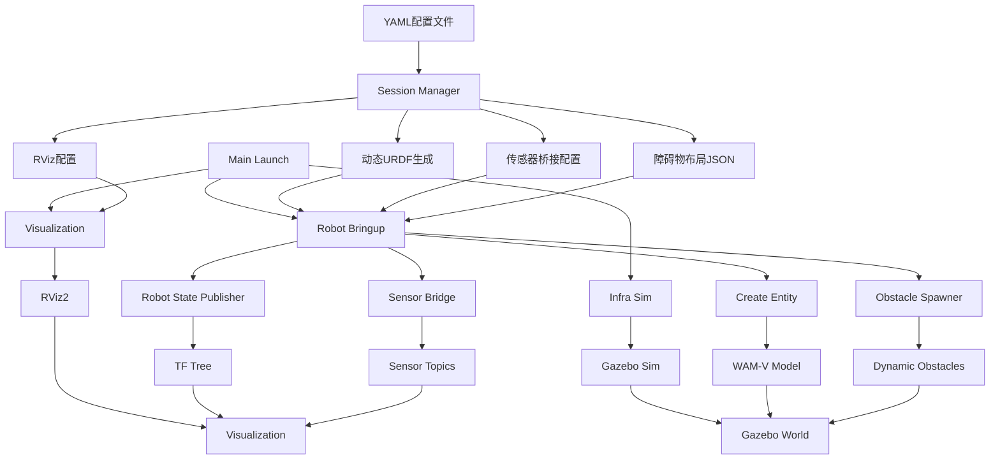

# USV Sim Full - 完整版无人船仿真系统

基于 ROS 2 + Gazebo Garden + VRX 的完整版无人船仿真系统，支持深度船体定制和程序化场景生成。

## 🚀 系统特性

### ✅ 模块化架构
- **Robot Bringup**: 封装机器人相关节点（状态发布、实体生成、传感器桥接）
- **Infra Sim**: 仅负责环境基础设施（Gazebo仿真、全局桥接）
- **Visualization**: 专门负责RViz可视化
- **Main Coordinator**: 组装各组件的协调器

### ✅ 深度船体定制
- 通过YAML配置船体Mesh路径、质量和惯性矩阵
- 支持动态URDF生成，无需重新编译
- 可定制外观和物理属性

### ✅ 程序化场景生成
- 支持"固定列表"和"随机区域生成"两种障碍物模式
- 自动生成圆柱或方体障碍物并加载到Gazebo
- 可配置数量、大小、颜色等参数

### ✅ 船体测试环境
- 提供简化水面仿真环境用于船体参数验证
- 可快速测试外观、碰撞体积、重力和浮力效果
- 无需启动完整复杂仿真

### ✅ 高度可扩展
- 为路径规划（Nav2）和定位（EKF）预留扩展点
- 支持多机协同仿真
- 传感器配置完全可定制

## 🏗️ 系统架构



## 安装和构建

```bash
# 进入工作空间
cd /home/cczh/simulation/vrx_ws

# 构建功能包
colcon build --packages-select usv_sim_full

# 源环境
source install/setup.bash
```

## ⚙️ 配置详解

### 机器人配置 (`config/full_config.yaml`)

```yaml
robot:
  name: "wamv_custom"
  # 基础模板
  xacro_template: "wamv_gazebo.urdf.xacro"
  spawn_pose: [0, 0, 0.5, 0, 0, 0]
  
  # 物理与外观覆盖
  overrides:
    visual_mesh: "package://my_custom_package/meshes/new_hull.dae"
    mass: 180.0
    inertia: [100.0, 100.0, 200.0]

obstacles:
  # 随机生成区域
  random_areas:
    - name: "zone_A"
      type: "cylinder"
      count: 10
      center: [15.0, 5.0]
      radius: 10.0
      size_range: [0.3, 0.8]
      color: "Red"
      
  # 固定障碍物列表
  fixed_list:
    - name: "buoy_start"
      type: "cylinder"
      pose: [5.0, 0.0, 0.0]
      size: [0.5, 1.0]
      color: "Green"
```

### 支持的传感器类型

- `vlp16`: VLP-16激光雷达（点云传感器）
- `camera`: RGB摄像头（图像传感器）

## 🚀 快速开始

### 1. 构建项目

```bash
cd /home/cczh/simulation/vrx_ws
colcon build --packages-select usv_sim_full
source install/setup.bash
```

### 2. 启动仿真

```bash
# 启动完整仿真系统
ros2 launch usv_sim_full main.launch.py

# 启动船体测试环境（用于验证船体参数）
ros2 launch usv_sim_full test_hull.launch.py
```

### 3. 自定义配置

修改 [config/full_config.yaml](file:///home/cczh/simulation/vrx_ws/src/usv_sim_full/config/full_config.yaml) 文件来自定义船体和场景：

1. 修改 `robot.overrides` 来定制船体物理/外观
2. 调整 `obstacles` 来配置场景中的障碍物
3. 重新启动仿真以应用更改

## 🧪 船体测试环境

我们提供了一个专门的船体测试环境，用于验证船体参数：

```bash
# 启动船体测试环境
ros2 launch usv_sim_full test_hull.launch.py
```

此环境包含：
- 简化的水面环境（[test_env/simple_water.sdf](file:///home/cczh/simulation/vrx_ws/src/usv_sim_full/test_env/simple_water.sdf)）
- 仅加载一个船体模型
- 包含RViz可视化
- 可快速测试船体外观、碰撞体积、重力和浮力交互

非常适合：
- 验证船体外观修改
- 测试物理参数（质量和惯性）
- 验证浮力和重力平衡
- 快速迭代船体设计

### 仿真组件

启动后将运行以下组件：

1. **Gazebo仿真环境**：加载指定的世界地图
2. **Robot State Publisher**：发布机器人TF变换
3. **Gazebo实体创建**：将生成的机器人模型添加到仿真中
4. **ROS-GZ桥接**：传输传感器数据和控制指令
5. **传感器桥接**：为每个配置的传感器创建数据传输通道
6. **遥测桥接**：传输里程计、关节状态和位姿数据
7. **RViz可视化**：动态配置的可视化界面

### 查看传感器数据

启动仿真后，可以通过以下命令查看传感器数据：

```bash
# 查看激光雷达点云数据
ros2 topic echo /sensors/lidar/front/points sensor_msgs/msg/PointCloud2

# 查看摄像头图像数据
ros2 topic echo /sensors/camera/front/image_raw sensor_msgs/msg/Image

# 查看里程计数据
ros2 topic echo /model/wamv/odometry nav_msgs/msg/Odometry
```

## Launch架构详解

### 1. `robot_bringup.launch.py` - 机器人容器
封装了所有与特定机器人相关的节点：
- Robot State Publisher：加载URDF模型
- Spawn Entity：使用指定姿态生成机器人模型
- Sensor Bridge：加载传感器桥接配置
- **预留扩展点**：为Nav2路径规划和EKF定位预留接口

### 2. `infra_sim.launch.py` - 基础设施仿真
仅负责环境基础设施：
- 启动Gazebo仿真环境
- 启动全局桥接（仅包含/clock等系统级话题）

### 3. `visualization.launch.py` - 可视化组件
- 负责启动RViz2
- 接收RViz配置文件路径参数

### 4. `main.launch.py` - 协调器
组装上述模块：
- 运行会话管理器获取配置路径
- 包含基础设施仿真组件
- 包含机器人启动组件（传入URDF和桥接配置路径）
- 包含可视化组件（传入RViz配置路径）

## 📁 目录结构

```
usv_sim_full/
├── config/                 # 配置文件
│   └── full_config.yaml    # 主配置文件
├── launch/                 # 启动文件
│   ├── main.launch.py      # 主启动文件
│   ├── test_hull.launch.py # 船体测试启动文件
│   └── components/         # 组件启动文件
│       ├── infra_sim.launch.py
│       ├── robot_bringup.launch.py
│       └── visualization.launch.py
├── scripts/                # 脚本文件
│   ├── session_manager.py  # 会话管理器
│   └── obstacle_spawner.py # 障碍物生成器
├── templates/              # 模板文件
│   ├── hull_macro.xacro    # 船体宏定义
│   └── sensor_macros.xacro # 传感器宏定义
├── test_env/               # 测试环境文件
│   └── simple_water.sdf    # 简化水面环境
└── logs/                   # 会话日志（运行时生成）
```

## 工作原理

1. **Session Manager**：读取YAML配置，生成临时文件
2. **Xacro Overlay**：创建覆盖层Xacro，将传感器添加到基础模型
3. **URDF编译**：将Xacro编译为最终的URDF模型
4. **桥接配置**：根据传感器配置生成ROS-GZ桥接映射
5. **RViz配置**：根据传感器配置动态生成RViz显示项
6. **模块化启动**：各组件独立启动，实现配置与启动逻辑的分离

## 自定义扩展

### 添加新传感器类型

1. 在 `templates/sensor_macros.xacro` 中添加新的传感器宏定义
2. 在 `session_manager.py` 中添加对该传感器类型的处理逻辑
3. 在配置文件中使用新类型

### 修改仿真环境

更改 `config/full_config.yaml` 中的 `world_name` 字段，指定不同的仿真环境。

### 扩展机器人功能

利用 `robot_bringup.launch.py` 中预留的扩展点，可以轻松添加：
- Nav2路径规划节点
- EKF定位节点
- 自定义控制节点

## 故障排除

- **传感器未显示**：检查配置文件中传感器的父链接名称是否正确（应为`wamv/base_link`）
- **桥接错误**：检查生成的桥接配置文件格式是否正确
- **模型加载失败**：确保WAM-V相关包已正确安装和编译
- **WAM-V模型未出现在仿真中**：确保使用了最新版本的代码，我们已修复了模型加载问题，现在使用`ros_gz_sim`的`create`节点正确加载模型
- **创建实体失败**：查看create节点的日志输出，确保URDF文件路径有效且格式正确
- **RViz中未显示传感器数据**：确认传感器话题在RViz中已正确配置，且桥接正常工作

## 🤝 贡献

欢迎提交 Issue 和 Pull Request 来帮助改进这个项目！

## 📄 许可证

该项目使用 MIT 许可证 - 查看 [LICENSE](file:///home/cczh/simulation/vrx_ws/src/usv_sim_full/LICENSE) 文件了解详情。