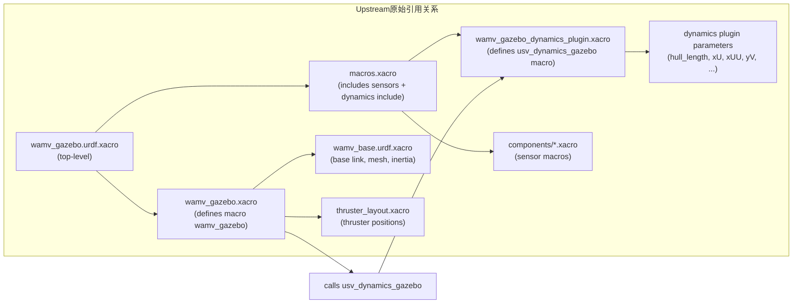
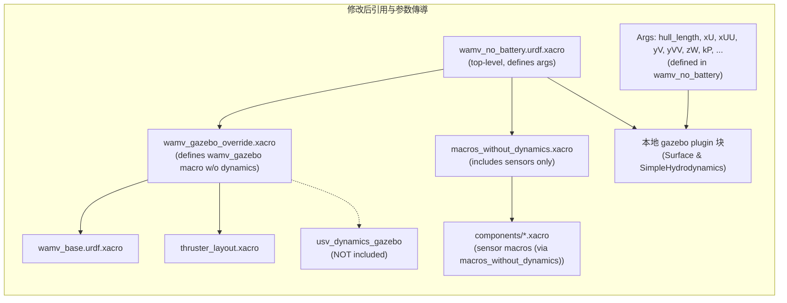

文档包含：

- 对“关键结论一（五个文件的角色）”的可视化与说明；
- 修改后（本地 override）引用与参数传递链路的可视化与逐项说明；
- 参数映射表与调用示例（如何从顶层传参到最终 plugin）。

## 关键结论一 — 五个文件的角色（图解）

解释：上游实现把 sensor 宏 和 dynamics 宏都放在一起（通过 macros.xacro），并且 wamv_gazebo.xacro 在宏内部直接调用 `usv_dynamics_gazebo`，因此若直接包含上游顶层文件，上游 dynamics 会被隐式注入并使用其硬编码参数，覆盖你的本地定制意图。



简洁说明：
- wamv_gazebo.urdf.xacro：上游顶层，定义大量 args（thruster_config、sensor enable、namespace 等），并包含 macros.xacro 与 wamv_gazebo.xacro。
- macros.xacro：包含多个 sensor component 的宏，同时（在上游实现中）也包含 dynamics 的 xacro（因此 dynamics 宏会被引入）。
- wamv_gazebo.xacro：定义 `wamv_gazebo` 宏；宏体包含 `wamv_base`、推进器布局并“调用” dynamics 宏（`usv_dynamics_gazebo`）。
- wamv_base.urdf.xacro：定义 `base_link`、visual（mesh）、collision、惯性等；要改 hull mesh / inertia，需在这一层或更上层做替换/覆盖。
- wamv_gazebo_dynamics_plugin.xacro：定义 `usv_dynamics_gazebo`，并把水动力参数（hull_length、xU、xUU、yV ...）写死在插件 XML 中——这是最终生效的位置。

结论：如果你“复制”了某些 xacro 文件但仍在顶层包含上游的 wamv_gazebo.xacro / macros.xacro，上游 dynamics 仍会被注入并覆盖本地想要控制的参数。

---

## 修改后（我们已实现的本地 override）— 引用与参数传导（图解）

解释：为避免上游 dynamics 自动注入，我在本地添加了 `macros_without_dynamics.xacro`（包含 sensors，但不包含 dynamics），并添加 `wamv_gazebo_override.xacro`（定义 `wamv_gazebo` 宏但不调用 `usv_dynamics_gazebo`）。顶层模板 wamv_no_battery.urdf.xacro 现在包含本地 override 并自己在末尾写入 `<gazebo>` plugin XML，插件内使用顶层 `xacro:arg` 值，从而实现参数从顶层向下传递。



传播说明（按步骤）：
1. 顶层在 wamv_no_battery.urdf.xacro 中定义了需要的水动力/浮力参数（例如 `hull_length`, `xU`, `xUU`, `yV`, `yVV`, `zW`, `kP` 等），并把这些参数作为 `xacro:arg`（已在文件中）。
2. wamv_no_battery.urdf.xacro 包含本地 `wamv_gazebo_override.xacro`，而该 override 包含 `wamv_base` 与推进器布局，但不会调用上游 dynamics 宏（因此不会把上游硬编码参数注入）。
3. `macros_without_dynamics.xacro` 提供 sensor 宏（camera, imu, gps 等），使得所有 sensor 宏调用仍然有效，但 dynamics 宏未被引入。
4. 最终，wamv_no_battery.urdf.xacro 自己在文档末尾插入 `<gazebo><plugin>...</plugin></gazebo>` 块（Surface 与 SimpleHydrodynamics），并在这些 plugin 字段内使用 `$(arg hull_length)` 等值 —— 这样参数从顶层直接充填到 plugin 内，完成层层传递。

优点：不修改上游包；把“是否注入 dynamics”控制权移到我们本地顶层，便于直接在 launch/xacro 调用时传参来自定义船体/水动力行为。

---

## 参数映射（顶层 arg -> 最终使用点）

下面表格列出关键参数及其定义/使用位置（当前实现）：

- hull_length
  - 在哪儿定义：wamv_no_battery.urdf.xacro（xacro:arg）
  - 在哪儿使用：本地 `<plugin filename="libSurface.so" name="vrx::Surface">` 的 `<hull_length>` 字段（写入最终 URDF）

- hull_radius
  - 定义：wamv_no_battery.urdf.xacro
  - 使用：`<hull_radius>` 字段（Surface plugin）

- fluid_level
  - 定义：wamv_no_battery.urdf.xacro
  - 使用：`<fluid_level>` 字段（Surface plugin）

- xDotU, yDotV, nDotR
  - 定义：wamv_no_battery.urdf.xacro
  - 使用：`<xDotU>`, `<yDotV>`, `<nDotR>`（SimpleHydrodynamics plugin 的附加质量部分）

- xU, xUU, yV, yVV, zW, kP, kPP, mQ, mQQ, nR, nRR
  - 定义：wamv_no_battery.urdf.xacro
  - 使用：SimpleHydrodynamics plugin 对应字段（线性/二次阻力、限制项等）

说明：在上游原始实现中这些字段在 wamv_gazebo_dynamics_plugin.xacro 内被硬编码（即直接写死）；我们现在从顶层定义并在本地 plugin 块中使用这些 args，从而覆盖原上游行为（前提是**不**同时包含导致上游 dynamics 调用的文件）。

---

## 示例：如何从命令行/launch 传参（快速示例）

在 ROS 环境下，生成 URDF（xacro）并传入参数的示例命令（假设你已 colcon build 并 source 了 workspace）：

```bash
# 将 args 传给 xacro，输出到临时 urdf 文件以供检查
xacro /home/cczh/USV_ROS/src/USV_Simulation/src/usv_sim_full/templates/wamv_no_battery.urdf.xacro \
  hull_length:=5.2 hull_radius:=0.25 xU:=200.0 xUU:=300.0 \
  -o /tmp/wamv_no_battery_generated.urdf
```

生成后，查看 `/tmp/wamv_no_battery_generated.urdf`，确认 `<gazebo><plugin>` 中的字段是否为你传入的值（例如 `<hull_length>5.2</hull_length>`）。

