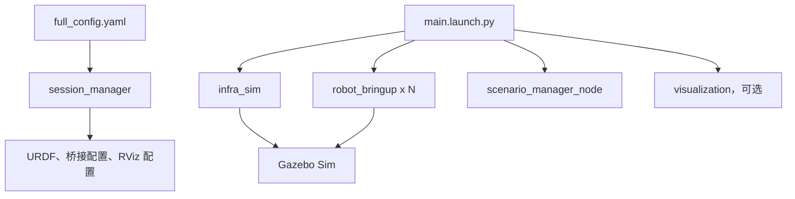

# 功能包架构

`launch/main.launch.py` 是完整仿真的主入口。

```mermaid
flowchart TB
    CFG[full_config.yaml] --> SESSION[session_manager]
    SESSION --> FILES[URDF、桥接配置、RViz 配置]
    MAIN[main.launch.py] --> INFRA[infra_sim]
    MAIN --> ROBOT[robot_bringup x N]
    MAIN --> SCENE[scenario_manager_node]
    MAIN --> VIZ[visualization，可选]
    INFRA --> GZ[Gazebo Sim]
    ROBOT --> GZ
```

启动顺序：

1. `session_manager` 读取配置并生成会话文件。
2. `infra_sim` 启动 Gazebo 世界和全局桥接。
3. `robot_bringup` 按船生成实体、状态发布器和传感器桥接。
4. 主入口按配置启动场景、真值、毫米波和海事雷达后处理组件。
