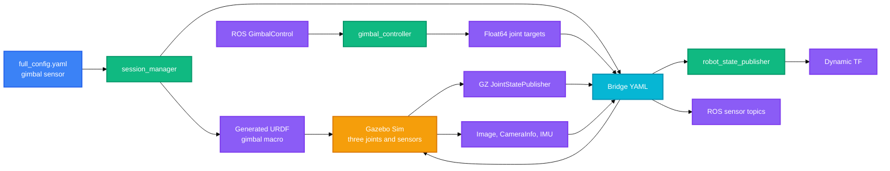

# 三轴云台摄像头

默认云台名称为 `payload_gimbal`，挂载于 `usv_1/base_link` 的 `(0.45, 0.0, 2.2)` 米位置。三轴顺序为 yaw、roll、pitch；高层 ROS 消息中的数组顺序固定为 `[roll, pitch, yaw]`。

## 快速测试

```bash
ros2 topic pub --once /usv_1/gimbal/payload_gimbal/control \
  usv_interfaces/msg/GimbalControl \
  "{mode: 2, angle: [0.0, -20.0, 45.0], speed: [0.0, 0.0, 0.0]}"
```

## 配置

云台通过每艘船的 `sensors` 列表声明。三视觉入口使用的配置文件是 `config/three_vision_one_mmwave/full_config.yaml`；默认全量仿真使用 `config/full_config.yaml`。两个文件都包含以下默认实例：

```yaml
- name: payload_gimbal
  type: gimbal
  parent_link: base_link
  xyz: [0.45, 0.0, 2.2]
  rpy: [0.0, 0.0, 0.0]
  image_topic: /sensors/camera/payload_gimbal/image_raw
  imu_topic: /sensors/imu/payload_gimbal/data
  control_topic: /gimbal/payload_gimbal/control
  enabled: true
```

`image_topic`、`imu_topic` 和 `control_topic` 均不包含船名。启动时会自动添加 `/{robot.name}` 前缀，因此以上配置在 `usv_1` 下生成 `/usv_1/...` 话题。

## 机械与 TF

云台的活动关节按 PX4 CGO3 模型的结构组织：

```text
usv_1/base_link
└─ usv_1/payload_gimbal_mount_link       fixed
   └─ usv_1/payload_gimbal_yaw_link      continuous, Z
      └─ usv_1/payload_gimbal_roll_link  revolute, X
         └─ usv_1/payload_gimbal_pitch_link  revolute, Y
            └─ usv_1/payload_gimbal_camera_link  fixed
```

| 轴 | 关节 | 限位 | 说明 |
|---|---|---|---|
| Yaw | `payload_gimbal_yaw_joint` | 连续旋转 | 绕 Z 轴。 |
| Roll | `payload_gimbal_roll_joint` | `[-45, 45] deg` | 绕 X 轴。 |
| Pitch | `payload_gimbal_pitch_joint` | `[-135, 45] deg` | 绕 Y 轴。 |

`wamv_no_battery.urdf.xacro` 加载 Gazebo `JointStatePublisher`。`session_manager` 将其 GZ 话题 `/world/<world>/model/<robot>/joint_state` 桥接到 `/<robot>/joint_states`，再由 namespaced `robot_state_publisher` 发布云台动态 TF。缺失此链路时，RViz 会因无法变换相机 frame 而丢弃图像。

## 数据链路



## ROS 通信接口

以下示例以机器人 `usv_1`、云台 `payload_gimbal` 为准。

| 用途 | ROS 2 话题 | 消息类型 | 方向 |
|---|---|---|---|
| 高层控制 | `/usv_1/gimbal/payload_gimbal/control` | `usv_interfaces/msg/GimbalControl` | ROS -> controller |
| 云台状态 | `/usv_1/gimbal/payload_gimbal/state` | `usv_interfaces/msg/GimbalState` | controller -> ROS |
| RGB 图像 | `/usv_1/sensors/camera/payload_gimbal/image_raw` | `sensor_msgs/msg/Image` | GZ bridge -> ROS |
| 相机内参 | `/usv_1/sensors/camera/payload_gimbal/camera_info` | `sensor_msgs/msg/CameraInfo` | GZ bridge -> ROS |
| 云台 IMU | `/usv_1/sensors/imu/payload_gimbal/data` | `sensor_msgs/msg/Imu` | GZ bridge -> ROS |
| 关节反馈 | `/usv_1/joint_states` | `sensor_msgs/msg/JointState` | GZ bridge -> ROS |

Gazebo 侧使用的关键话题如下：

| 用途 | Gazebo Transport 话题 | 消息类型 |
|---|---|---|
| Roll 命令 | `/model/usv_1/command/payload_gimbal/roll` | `gz.msgs.Double` |
| Pitch 命令 | `/model/usv_1/command/payload_gimbal/pitch` | `gz.msgs.Double` |
| Yaw 命令 | `/model/usv_1/command/payload_gimbal/yaw` | `gz.msgs.Double` |
| 关节状态 | `/world/sydney_regatta/model/usv_1/joint_state` | `gz.msgs.Model` |

关节状态话题中的世界名随 `environment.world_name` 改变。

## 控制接口

### `usv_interfaces/msg/GimbalControl`

```text
std_msgs/Header header
uint8 mode
float32[3] angle  # [roll, pitch, yaw], deg
float32[3] speed  # [roll, pitch, yaw], deg/s
```

| `mode` | 行为 |
|---:|---|
| `0` | 不更新命令；云台保持最后一个目标。 |
| `1` | 速度控制。控制器在收到命令后的 0.5 秒内积分 `speed`；需要持续发布速度命令。 |
| `2` | 角度控制。将 `angle` 直接转换为弧度并按关节限位裁剪。 |
| `3` | 混合控制。以 `speed` 推进，并以 `angle` 作为目标角限制。 |

所有最终关节位置命令使用弧度。Roll 和 pitch 会按机械限位裁剪；yaw 不裁剪。

### 控制示例

回中：

```bash
ros2 topic pub --once /usv_1/gimbal/payload_gimbal/control \
  usv_interfaces/msg/GimbalControl \
  "{mode: 2, angle: [0.0, 0.0, 0.0], speed: [0.0, 0.0, 0.0]}"
```

持续以 `20 deg/s` 增加 yaw：

```bash
ros2 topic pub -r 10 /usv_1/gimbal/payload_gimbal/control \
  usv_interfaces/msg/GimbalControl \
  "{mode: 1, angle: [0.0, 0.0, 0.0], speed: [0.0, 0.0, 20.0]}"
```

停止上述命令发布后，速度控制超时，云台保持最后一个关节目标。

## 代码位置

| 位置 | 职责 |
|---|---|
| `description/urdf/sensor_macros.xacro` | `gimbal_macro`、三轴关节、传感器和 Gazebo 关节控制器。 |
| `description/urdf/wamv_no_battery.urdf.xacro` | 模型级 Gazebo `JointStatePublisher`。 |
| `description/models/px4_gimbal/meshes/` | 复制自 PX4 CGO3 云台的四个 STL 外观资源。 |
| `description/models/px4_gimbal/README.md` | PX4 资源来源和 BSD-3-Clause 许可说明。 |
| `config/full_config.yaml` | 默认全量仿真的云台实例。 |
| `config/three_vision_one_mmwave/full_config.yaml` | 三视觉毫米波入口使用的云台实例。 |
| `usv_sim_full/scripts/session_manager.py` | gimbal YAML 解析、Xacro 叠加层和 bridge YAML 生成。 |
| `usv_sim_full/scripts/gimbal_controller.py` | 纯 ROS 三轴控制、限位、状态发布和关节反馈处理。 |
| `launch/main.launch.py` | 为每个启用的 gimbal 传感器启动控制节点。 |
| `setup.py` | `gimbal_controller` console script 注册。 |
| `test/test_gimbal_config.py` | 配置、bridge、PX4 mesh 和状态消息回归测试。 |

## PX4 参考范围

复制到本包的是 PX4-Autopilot `Tools/simulation/gz/models/gimbal/meshes/` 下的 CGO3 STL 外观资源。云台的三轴拓扑、限位和 Gazebo `JointPositionController` 初始 PID 也参考该模型。

未复制或依赖 PX4 的部分包括：X500 飞行器、PX4 `GZGimbal`、uORB、MAVLink Gimbal Protocol v2、MAVROS 和 PX4 airframe。当前控制链完全由 ROS 2 和 `ros_gz_bridge` 提供。

## 调试

| 现象 | 检查项 |
|---|---|
| `ros2 topic pub` 一直等待订阅者 | 检查 `ros2 node info /gimbal_controller_usv_1_payload_gimbal`；确认已重新构建、source 并重启 launch。 |
| 控制节点退出 | 使用 `verbose_launch:=true` 启动；检查终端和 `~/.ros/log` 中 `gimbal_controller` 的 traceback。 |
| RQt 有图像但 RViz 丢图 | 检查 `/usv_1/joint_states` 是否包含三个云台关节，并检查 `base_link` 到 `payload_gimbal_camera_link` 的 TF。 |
| 云台不运动 | 检查三个 `cmd_pos` ROS 话题、对应 GZ command topic 和 `gz-sim-joint-position-controller-system` 插件加载日志。 |
| PX4 mesh 未显示 | 确认重新构建，且 `GZ_SIM_RESOURCE_PATH` 由 `infra_sim.launch.py` 包含 `description/models`。 |

## 当前限制

- 云台按船体相对关节运动，不包含世界系锁定或船体横摇、纵摇补偿。
- 仅支持 RGB 相机和 IMU；未实现深度相机、红外图像或变焦。
- 不实现 MAVLink Gimbal Protocol v2、PX4 云台设备发现、云台管理器或地理 ROI 指向。
- 三视觉真值检测仍使用其固定相机配置；云台图像不自动成为该检测融合链的一路输入。
