# USV 全栈仿真体系架构报告

> **文档版本**：面向汇报版  
> **入口 Launch**：`launch/nav2_sim_three_vision_mmwave_bringup.launch.py`  
> **默认配置目录**：`config/three_vision_one_mmwave/`  
> **适用场景**：Sydney Regatta 水域全栈仿真 — 三视觉 + 毫米波感知 + 后融合 + Nav2 导航 + PX4 飞控联调

---

## 一、执行摘要

### 1.1 体系定位

本工作区已建成一套 **模块化、YAML 可配置** 的无人船（USV）全栈仿真体系。体系按功能划分为 **仿真、感知、导航、控制、通信** 五大域，共 **30+ 个可独立开关的功能模块**。**仿真域**提供 Gazebo 物理环境与场景编排能力，是整体验证底座；**感知、导航、控制、通信** 四域对应 **实船搭载功能模块**，在仿真环境中以数字孪生方式运行，可对实船软硬件进行联调与回归，而无需改动核心架构。

绝大多数运行参数均可通过 YAML 文件调节，无需修改源码即可切换场景、传感器布局、后融合策略、导航行为与飞控通信方式。

### 1.2 当前仿真可实现的功能（文字说明）

**物理与环境仿真**  
可在 Gazebo Harmonic 中加载 Sydney Regatta 等水域世界，模拟本船浮力、水动力响应及风、流等环境扰动。支持按 YAML 配置船体型号、推进器布局、传感器安装位姿与静态障碍物（浮标等），一键生成多船会话及 ROS–Gazebo 桥接配置。

**多传感器数据生成**  
可仿真 LiDAR、三目相机、IMU、GPS、磁力计、气压计、海事导航雷达与前向毫米波雷达等传感器，输出带噪声、有限视场与更新率约束的原始数据流，话题命名与实船部署保持一致，供下游算法与飞控直接使用。

**周邻目标与场景编排**  
可生成 3 艘及以上周邻目标船，按固定航路（waypoint）或 CTRV 模型运动，并同步在 Gazebo 中显示目标船 mesh 模型。支持通过 `scenario_manager` 与认证场景工具链编排会遇局面，为避碰算法与合规性验证提供可重复试验条件。

**多传感器后融合感知**  
在仿真中，三视觉（150° 对称布局）与前向毫米波可从运动真值生成带延迟与误差的检测结果，经后融合节点输出统一场景快照（`FusedSceneSnapshot`）与航迹列表，并转换为 Nav2 可用的 `TrackedShipList`，驱动 COLREGs 代价地图中的周邻船投影避碰层。

**自主导航与避碰**  
可加载静态电子海图，结合 LiDAR 局部障碍、融合周邻船目标与 COLREGs 规则，完成全局路径规划（A*）、局部代价地图更新与 ALOS 自适应视线控制，输出本船速度指令。Nav2 在 TF 与地图就绪后自动启动，避免导航栈因坐标系未就绪而失败。

**飞控与执行控制**  
支持两条执行链路：默认路径为 Nav2 → `cmd_vel_to_thruster` 双 PID 差速控制 → Gazebo 推进器；验证路径为 PX4 固件 SITL（机架 50000 差速 Rover）经 `gz_bridge` 直接订阅仿真传感器、发布推力指令，并可经 MAVROS 接收 Nav2 速度设定（OFFBOARD 实验模式）。两条路径互斥，模拟实船「导航计算机 + 飞控」分工。

**通信与岸基对接（实船搭载模块）**  
工作区已集成 MAVLink 协议栈（`mavlink` + `mavros`），支持 PX4 飞控 UDP 通信、模式切换与速度设定下发；`usv_mqtt_bridge` 预留岸基 MQTT 数据通道。通信域各模块与实船协议栈一致，在仿真中经 `ros_gz_bridge` 与仿真域 Gazebo 环境对接。

**一键全栈启动**  
`nav2_sim_three_vision_mmwave_bringup.launch.py` 可一键拉起：Gazebo 仿真 → 周邻目标真值 → 真值感知仿真 → 后融合 → Nav2 导航 → 推进器控制，并支持按 Launch 参数独立关闭感知链、导航栈或 GUI 渲染。

### 1.3 核心能力一览

| 能力 | 状态 | 域属性 | 配置方式 |
|------|------|--------|----------|
| Gazebo Harmonic 物理仿真（浮力/水动力/风/流） | 已集成 | 仿真域 | `full_config.yaml` |
| 多传感器数据生成（LiDAR/相机/IMU/GPS/雷达/毫米波） | 已集成 | 仿真域 | `sensor_config.yaml` + `full_config.yaml` |
| 周邻目标真值与感知仿真 | 已集成 | 仿真域（支撑感知模块验证） | `full_config.yaml` + `ground_truth_sensor_sim_params.yaml` |
| 多传感器后融合 | 已集成 | 实船搭载模块（感知域） | `event_fusion_*.yaml` |
| Nav2 自主导航（COLREGs 避碰） | 已集成 | 实船搭载模块（导航域） | `radar_nav2_param.yaml` |
| PX4 固件 SITL 仿真（差速 Rover 模式） | 已集成 | 实船搭载模块（控制域） | PX4 机架参数 + `full_config.yaml` |
| MAVROS / MAVLink 飞控通信 | 已集成 | 实船搭载模块（通信域） | `px4.launch` + `px4_config.yaml` |
| Nav2 → MAVROS → PX4 OFFBOARD | 实验性 | 实船搭载模块（导航+控制+通信） | 话题重映射 + MAVROS |
| 船级社认证会遇场景案例库 | 建设中 | 仿真 + 导航合规验证 | `certificate_case/*.yaml` |

### 1.4 船级社认证场景案例建设

为支撑无人船 **船级社认证（智能航行 / 避碰合规）** 试验需求，工作区正在建设标准化 **会遇局面场景案例库**，与全栈仿真体系解耦、可独立调用。

**建设目标**  
覆盖 COLREGs 典型会遇局面（对遇、交叉、追越等），以可重复、可参数化、可自动评测的方式，验证本船感知–导航–控制链路在危险会遇场景下的响应是否符合规范要求，为船级社审查提供仿真试验记录与场景复现能力。

**案例规模与分类**（`config/certificate_case/`）

| 类别 | 编号 | 内容 | 场景数 |
|------|------|------|--------|
| C1 | C1-001～010 | 单船会遇：危险/非危险 对遇、右交叉、左交叉、追越、被追越 | 10 |
| C2 | C2-001～005 | 危险主目标 + 非危险远距干扰船 | 5 |
| C3 | C3-001～015 | 两艘危险船**依次**会遇 | 15 |
| C4 | C4-001～011 | 两艘危险船**同时**会遇 | 11 |
| **合计** | — | — | **41** |

**技术实现**  
- 规则对照文档：`config/certificate_case/senario_cule.md`  
- 批量生成工具：`tools/generate_certificate_cases.py`  
- 场景合并工具：`tools/merge_certi_config.py`（基底 `certi_senario.yaml` + 案例 YAML → 完整 `full_config`）  
- 专用 Launch：`certifi_launch.launch.py`（合并配置后启动仿真 + 本船定速定向 `cmd_vel` 链）  
- 每个案例可配置：本船初速/航向、目标船会遇类型、DCPA/TCPA、会遇距离、多船延迟 spawn 等

**启动示例**

```bash
ros2 launch usv_sim_full certifi_launch.launch.py \
  case_config:=src/usv_simulation/usv_sim_full/config/certificate_case/C1-001.yaml
```

**与全栈仿真的关系**  
认证场景侧重 **会遇几何与合规性** 验证，默认走 `certifi_launch` 简化感知链；全栈 bringup（`nav2_sim_three_vision_mmwave_bringup`）侧重 **多传感器后融合 + Nav2 完整避碰** 能力展示。二者共享同一套仿真底座（`usv_sim_full` + YAML 配置体系），可按认证阶段逐步将后融合与 Nav2 COLREGs 层接入认证评测流程。

---

## 二、五大功能域与模块清单

### 2.1 域划分原则

| 功能域 | 属性 | 说明 |
|--------|------|------|
| **仿真域** | **仿真环境底座** | Gazebo 物理引擎、船体/传感器模型、场景编排、周邻目标真值与数据桥接，为实船模块提供可重复试验环境 |
| **感知域** | **实船搭载功能模块** | 实船视觉/毫米波检测与后融合算法；仿真中以 `ground_truth_sensor_sim` 替代真实传感器输入 |
| **导航域** | **实船搭载功能模块** | 实船自主导航计算机（Nav2 规划、避碰、速度指令生成） |
| **控制域** | **实船搭载功能模块** | 实船飞控（PX4）与推进器执行层 |
| **通信域** | **实船搭载功能模块** | 实船 MAVLink 飞控链路、岸基 MQTT 及机载 ROS 2 通信中间件 |

### 2.2 体系总览

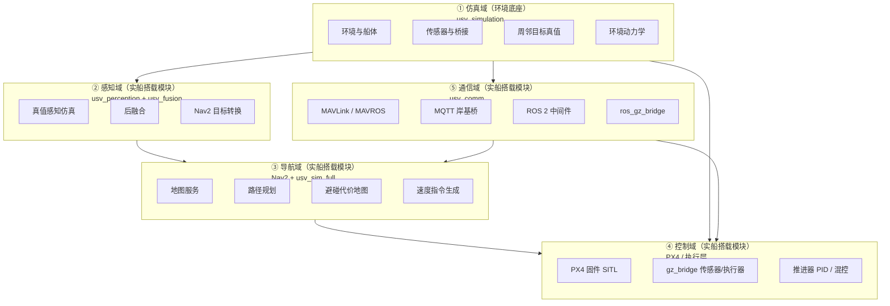

### 2.3 模块统计

| 功能域 | 模块数 | 域属性 | 主要 ROS 包 | 核心 YAML 配置 |
|--------|--------|--------|-------------|----------------|
| **仿真** | 12 | 仿真环境底座 | `usv_sim_full`, `ground_truth_sim`, `sensor_plugins` | `full_config.yaml`, `sensor_config.yaml` |
| **感知** | 6 | **实船搭载模块** | `ground_truth_sensor_sim`, `usv_late_fusion`, `convert_to_trackship` | `ground_truth_sensor_sim_params.yaml`, `event_fusion_*.yaml` |
| **导航** | 5 | **实船搭载模块** | Nav2, `usv_sim_full` | `radar_nav2_param.yaml`, `sydney_map2.yaml` |
| **控制** | 4 | **实船搭载模块** | `PX4-Autopilot`, `usv_sim_full` | PX4 机架 `50000_*`, `full_config.yaml` |
| **通信** | 5 | **实船搭载模块** | `mavros`, `mavlink`, `usv_mqtt_bridge`, `ros_gz_bridge` | `px4_config.yaml`, `certi_senario.yaml` 等 |
| **合计** | **32** | — | — | **均可通过 YAML / Launch 参数调节** |

### 2.4 YAML 配置驱动架构

体系采用 **「一层整机配置 + 多层专项配置」** 的分层设计：改场景、改传感器、改后融合、改导航、改飞控对齐，均只需编辑对应 YAML，由 Launch 在启动时加载。

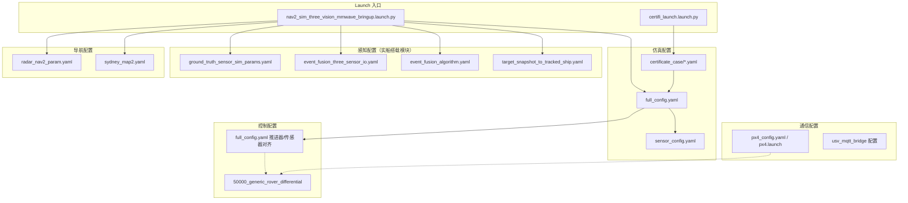

---

## 三、仿真域（仿真环境底座）

仿真域 **不是实船搭载模块**，而是为实船各功能模块提供验证的 **数字孪生试验环境**。负责在 Gazebo 中构建物理世界、本船与传感器模型、场景编排、周邻目标运动真值及 ROS–Gazebo 数据桥接，使感知、导航、控制、通信等实船模块可在脱离真实水域的条件下完成联调与回归。

### 3.1 模块清单

| # | 模块 | 节点/组件 | 职责 | 配置来源 |
|---|------|-----------|------|----------|
| 1 | 会话管理 | `session_manager` | 读整机配置，生成 URDF、ros_gz 桥接 YAML、RViz 配置 | `full_config.yaml` |
| 2 | 基础设施 | `infra_sim` | 启动 Gazebo Harmonic、全局 `/clock` 桥接 | `full_config.yaml` → `environment.world_name` |
| 3 | 机器人部署 | `robot_bringup` | 船体 spawn、传感器桥接、TF 广播 | session 生成 + `full_config.yaml` |
| 4 | 障碍物生成 | `obstacle_spawner` | 静态浮标/障碍物布局 | session 生成 `obstacle_layout` |
| 5 | 周邻目标真值 | `scenario_ground_truth_gazebo_entity` 或 `scenario_ground_truth_node` | `gazebo_visual=true` 时由 Gazebo 实体 pose 发布 `/sim/ground_truth`；否则 kinematic 积分 | `full_config.yaml` → `scenario.ground_truth_sim` |
| 6 | （已合并） | — | 原 `ground_truth_gazebo_models` 双轨模式已由实体权威单节点取代 | — |
| 7 | 场景管理 | `scenario_manager_node` | 场景级调度与配置热加载 | `full_config.yaml` |
| 8 | 环境动力学 | `usv_env_dynamics` | 风、流对船体施加外力 | `full_config.yaml` → `env_dynamics` |
| 9 | 状态封装 | `usv_sim_wrapper` | 统一本船状态话题 | `full_config.yaml` |
| 10 | 毫米波后处理 | `mmwave_4d_cloud_node` | gpu_ray 点云 → 4D 增强 | `sensor_config.yaml` → `mmwave` |
| 11 | 毫米波聚类 | `mmwave_cluster_node` | DBSCAN 聚类 → 目标数组 | `sensor_config.yaml` → `mmwave.cluster` |
| 12 | 海事雷达处理 | `gy_radar_driver` | 扫描雷达 → 占用栅格地图 | `sensor_config.yaml` → `radar.maritime` |

### 3.2 关键 YAML 调节项

**`full_config.yaml`（整机主配置）**

| 配置块 | 可调节内容 | 示例 |
|--------|-----------|------|
| `environment` | 仿真世界名称 | `world_name: sydney_regatta` |
| `robot_N` | 船名、URDF 模板、spawn 位姿、推进器布局 | `name: usv_1` |
| `robot_N.sensors[]` | 传感器类型、安装位姿、话题名、开关 | `type: camera`, `enabled: true` |
| `robot_N.buoyancy_params` | 浮力、水动力系数 | `xU`, `nR`, `zW` 等 |
| `scenario.ground_truth_sim` | 周邻目标数量、航路、速度、尺寸 | `fixed_targets[]`, `motion_mode: waypoint` |
| `obstacles` | 静态障碍物列表 | 浮标位置、颜色 |
| `visualization` | RViz 开关、遥测 | `launch_rviz: true` |

**`sensor_config.yaml`（Gazebo 传感器内参）**

| 配置块 | 可调节内容 |
|--------|-----------|
| `lidar` | 扫描频率、量程、噪声 |
| `camera` | FOV、分辨率、畸变、帧率 |
| `imu` / `gps` / `magnetometer` / `barometer` | 各传感器噪声与更新率 |
| `radar.maritime` | 海事雷达量程、角分辨率、转速 |
| `mmwave` | 毫米波 FOV、RCS、聚类参数 |

### 3.3 默认场景参数

- **环境**：`sydney_regatta` 世界 + 静态浮标 `buoy_start`
- **本船**：`usv_1`（M5 船体 mesh，双推进器，风/流动力学）
- **周邻目标**：3 艘 10m mesh 船，`motion_mode=waypoint`，东西向 ping-pong 航路
- **传感器**：前向 LiDAR、三相机（150° 对称）、IMU/GPS/磁力/气压、海事导航雷达、前向毫米波

### 3.4 Gazebo 仿真层数据流

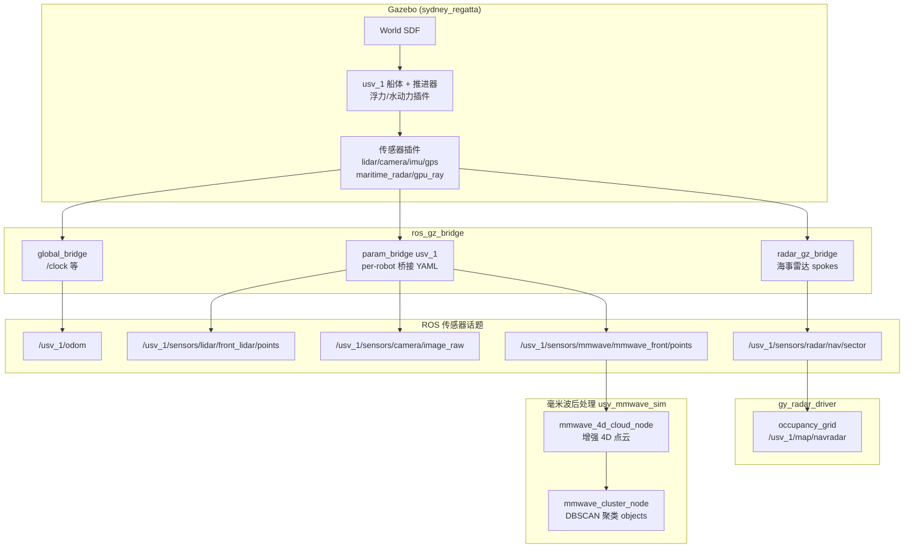

---

## 四、感知域（实船搭载功能模块）

感知域对应实船 **视觉/毫米波目标检测与后融合计算机**。实船部署时运行真实检测算法与 `usv_late_fusion` 后融合节点；仿真验证阶段，以 `ground_truth_sensor_sim` 从运动真值生成等效检测输入，**后融合及下游接口与实船一致**，便于算法迭代后直接迁移上船。

采用 **「双轨感知」** 设计：本船近距离障碍靠 Gazebo LiDAR（仿真域数据）；远程周邻船靠真值感知仿真（仿真域供给输入）+ 后融合（实船搭载模块）。

### 4.1 模块清单

| # | 模块 | 节点 | 输入 | 输出 | 配置来源 |
|---|------|------|------|------|----------|
| 1 | 前向视觉仿真 | `sim_vision_front` | `/sim/ground_truth` | `/vision/front/detections` | `ground_truth_sensor_sim_params.yaml` |
| 2 | 左侧视觉仿真 | `sim_vision_left` | `/sim/ground_truth` | `/vision/left/detections` | 同上 |
| 3 | 右侧视觉仿真 | `sim_vision_right` | `/sim/ground_truth` | `/vision/right/detections` | 同上 |
| 4 | 前向毫米波仿真 | `sim_mmwave_front` | `/sim/ground_truth` | `/mmwave/front/targets` | 同上 |
| 5 | 后融合 | `late_fusion_node` | 上述 4 路检测 | `/fusion/snapshot` 等 | `event_fusion_three_sensor_io.yaml` + `event_fusion_algorithm.yaml` |
| 6 | 目标格式转换 | `target_snapshot_to_tracked_ship` | `/fusion/snapshot` | `/tracked_ship` | `target_snapshot_to_tracked_ship.yaml` |

> 注：ROS 包名 `usv_late_fusion` 保持代码仓库命名不变，文档统一称 **后融合**。

### 4.2 关键 YAML 调节项

**`ground_truth_sensor_sim_params.yaml`**

| 节点段 | 可调节内容 |
|--------|-----------|
| `sim_vision_*` | FOV 半角、角度/距离噪声、检测延迟、发布频率、相机安装 yaw |
| `sim_mmwave_front` | FOV、径向噪声、速度分辨率、运动速度阈值 |

**`event_fusion_three_sensor_io.yaml`**

| 参数 | 可调节内容 |
|------|-----------|
| `vision_topics` / `vision_camera_yaws` | 视觉输入话题与安装角 |
| `mmwave_topic` | 毫米波输入话题 |
| `fusion_snapshot_topic` | 后融合输出话题 |
| `track_publish_hz` | 轨迹发布频率 |

**`event_fusion_algorithm.yaml`**

| 参数 | 可调节内容 |
|------|-----------|
| 关联门限、航迹管理 | 后融合关联算法、航迹生命周期、ID 管理策略 |

### 4.3 三视觉布局

| 相机 | yaw | 半角 FOV | 检测话题 |
|------|-----|----------|----------|
| front | 0° | 60° | `/vision/front/detections` |
| left | -45° | 60° | `/vision/left/detections` |
| right | +45° | 60° | `/vision/right/detections` |

毫米波真值仿真：前向 120° FOV → `/mmwave/front/targets`

### 4.4 感知数据流

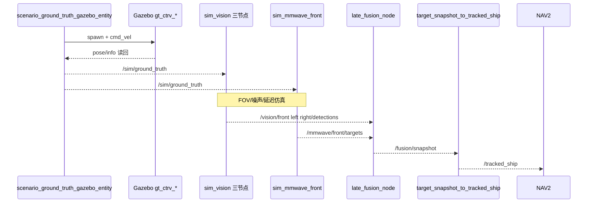

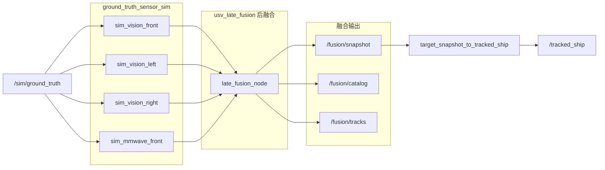

---

## 五、导航域（实船搭载功能模块）

导航域对应实船 **自主导航计算机**，基于 Nav2 导航栈，结合静态海图、LiDAR 局部障碍与后融合周邻船目标，实现路径规划与 COLREGs 避碰控制。仿真与实船部署使用相同的 `radar_nav2_param.yaml` 参数体系。

### 5.1 模块清单

| # | 模块 | 节点 | 职责 | 配置来源 |
|---|------|------|------|----------|
| 1 | 静态地图 | `map_server` | 加载 PGM 海图，发布 `/map` | `sydney_map2.yaml` |
| 2 | 地图生命周期 | `lifecycle_manager_map` | 自动激活 map_server | Launch 参数 |
| 3 | TF 就绪门控 | `nav2_tf_readiness_gate` | 等待 TF + 地图就绪后再启 Nav2 | Launch 参数 |
| 4 | Nav2 导航栈 | planner / controller / bt_navigator 等 | 全局规划、局部避障、行为树 | `radar_nav2_param.yaml` |
| 5 | 清除扫描 | `clearing_scan_publisher` | 发布虚拟 clearing 点云，清除过时障碍 | Launch 内嵌参数 |

### 5.2 关键 YAML 调节项

**`radar_nav2_param.yaml`**

| 配置块 | 可调节内容 |
|--------|-----------|
| `global_costmap` | 全局代价地图尺寸、分辨率、插件组合 |
| `local_costmap` | 局部滚动窗口大小、更新频率 |
| `obstacle_layer` | LiDAR 话题、障碍高度、量程 |
| `ts_projection_layer` | 周邻船投影层开关、超时 |
| `inflation_layer` | 膨胀半径、代价衰减 |
| `controller_server` | ALOS 控制器速度/加速度限制 |
| `planner_server` | A* / Dijkstra 选择、容忍度 |

### 5.3 Costmap 插件组合

| 层 | 作用 | 数据来源 |
|----|------|----------|
| `static_layer` | 静态海图障碍 | `/map`（map_server） |
| `obstacle_layer` | 动态障碍标记/清除 | LiDAR 点云 + clearing_scan |
| `ts_projection_layer` | 周邻船投影避碰 | `/tracked_ship`（后融合输出） |
| `inflation_layer` | 安全膨胀区 | 上述层叠加 |

**控制器**：`nav2_colregs_alos_controller::ALOSController`（自适应视线制导，适配船舶侧滑与 COLREGs 规则）。

### 5.4 导航闭环

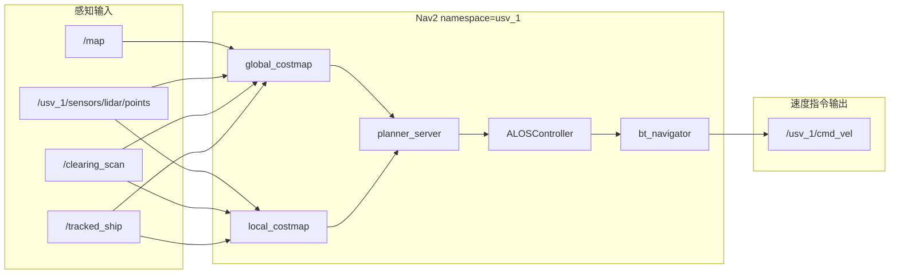

---

## 六、控制域（实船搭载功能模块）

控制域对应实船 **飞控计算机与推进器执行层**。以 **PX4 固件 SITL** 为核心，同时保留 `cmd_vel_to_thruster` 联调路径。实船部署时 PX4 经 MAVLink 与机载计算机通信；仿真中通过 `gz_bridge` 或 MAVROS 复现同一拓扑。

### 6.1 控制路径总览

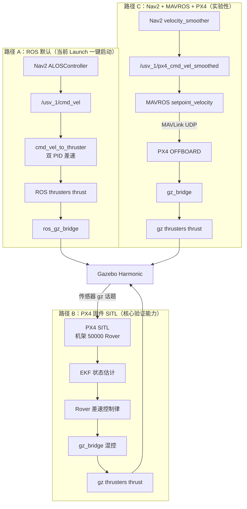

> **重要**：路径 A 与路径 B/C **互斥**，不可同时对同一艘船发布推力指令。

### 6.2 PX4 固件仿真模块

| # | 模块 | 说明 | 配置/源码位置 |
|---|------|------|---------------|
| 1 | PX4 SITL | 软件在环飞控仿真，独立 `make` 构建 | `third_party/PX4-Autopilot/` |
| 2 | 机架 50000 | 差速 Rover 模式，映射 USV 双推进器 | `ROMFS/.../50000_generic_rover_differential` |
| 3 | gz_bridge 传感器 | 订阅 Gazebo IMU/GPS/Mag/Baro | `gz_bridge/GZBridge.cpp` |
| 4 | gz_bridge 执行器 | 发布左右桨推力（±2350） | `GZMixingInterfaceServo.cpp` |
| 5 | cmd_vel_to_thruster | ROS PID 差速控制（默认路径） | `usv_sim_full/scripts/cmd_vel_to_thruster.py` |

### 6.3 PX4 实现思路

PX4 不提供原生 Boat/USV 船体模型。本方案将 USV 视为 **差速 Rover（Airframe 50000）**：

1. `usv_sim_full` 在 Gazebo 中生成双推进器船体，暴露传感器与推进器的 **gz-transport** 话题；
2. PX4 SITL 运行 Rover 控制律，经本地补丁 `gz_bridge` **直接对接** `usv_1` 的 gz 话题；
3. ROS 2 主链路（Nav2、感知、RViz）仍由 `ros_gz_bridge` 承担；
4. PX4 与 ROS **并行附着**在同一 Gazebo 实例，传感器数据同源。

### 6.4 传感器与执行器话题对齐

| 类型 | Gazebo / ROS 话题 | PX4 订阅/发布 |
|------|-------------------|---------------|
| IMU | `/usv_1/sensors/imu/imu_sensor/data` | 订阅 → EKF |
| GPS | `/usv_1/sensors/gps/gps_sensor/data` | 订阅 → EKF |
| 磁力计 | `/usv_1/sensors/magnetometer/mag_sensor/data` | 订阅 → EKF |
| 气压计 | `/usv_1/sensors/barometer/baro_sensor/fluid_pressure` | 订阅 → EKF |
| 左推进器 | `/usv_1/thrusters/left/thrust` | 发布（Servo 1） |
| 右推进器 | `/usv_1/thrusters/right/thrust` | 发布（Servo 0） |

### 6.5 PX4 启动方式

```bash
# 1. 编译 PX4（首次或上游更新后）
cd src/usv_simulation/third_party/PX4-Autopilot
make px4_sitl_default

# 2. 先启动 usv_sim_full 仿真（Gazebo 须已运行）
ros2 launch usv_sim_full main.launch.py

# 3. 独立终端启动 PX4 SITL（Standalone 模式）
PX4_GZ_STANDALONE=1 PX4_GZ_WORLD=sydney_regatta \
PX4_SYS_AUTOSTART=50000 PX4_SIM_MODEL=gz_rover_differential \
./build/px4_sitl_default/bin/px4
```

### 6.6 控制路径对比

| 对比项 | 路径 A：cmd_vel_to_thruster | 路径 B/C：PX4 固件 |
|--------|----------------------------|-------------------|
| 定位 | 默认联调路径，Launch 一键启动 | 飞控算法验证、硬件在环前仿真 |
| 输入 | `/usv_1/cmd_vel` + `/usv_1/odom` | gz 传感器 + OFFBOARD 速度（路径 C） |
| 控制律 | 本地双 PID（线速度 + 角速度） | PX4 EKF + Rover 差速混控 |
| 最大推力 | 1000（可调） | ±2350（机架映射） |
| 状态估计 | 依赖 Gazebo odom / 可选 robot_localization | PX4 内置 EKF |
| 与 Nav2 集成 | 开箱即用 | 路径 C 需 MAVROS + 话题重映射 |

---

## 七、通信域（实船搭载功能模块）

通信域对应实船 **机载计算机与飞控、岸基系统之间的协议栈**（MAVLink、MQTT、ROS 2 中间件），在仿真中验证与实船一致的通信拓扑与接口。

### 7.1 模块清单

| # | 模块 | 包/组件 | 职责 | 配置来源 |
|---|------|---------|------|----------|
| 1 | MAVLink 协议库 | `mavlink` | MAVLink 消息编解码（pymavlink） | 上游 vendored |
| 2 | MAVROS 桥 | `mavros` | ROS 2 ↔ MAVLink，飞控状态/指令转换 | `px4_config.yaml`, `px4_pluginlists.yaml` |
| 3 | MAVROS 启动 | `px4.launch` | PX4 UDP 连接（默认 14580） | `fcu_url` 参数 |
| 4 | USV MAVLink 桥 | `usv_mavlink_bridge` | 统一 Autopilot 话题桥（骨架，待实现） | `bridge_topics.yaml`（规划） |
| 5 | MQTT 岸基桥 | `usv_mqtt_bridge` | 船岸数据 MQTT 上报/下发 | MQTT broker 配置 |
| 6 | Gazebo–ROS 桥 | `ros_gz_bridge` | 仿真传感器/执行器与 ROS 话题互通 | session 生成 bridge YAML |

### 7.2 通信拓扑

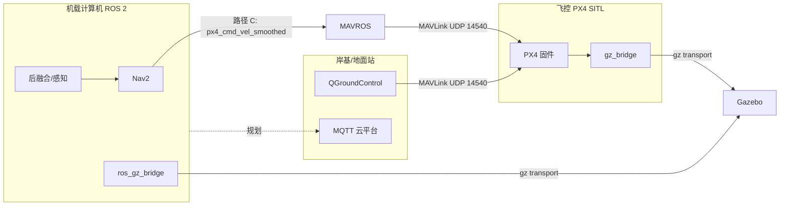

### 7.3 关键 YAML / 配置

| 配置 | 路径 | 用途 |
|------|------|------|
| MAVROS 节点参数 | `mavros/launch/px4_config.yaml` | 插件开关、坐标系、话题名 |
| MAVROS 插件列表 | `mavros/launch/px4_pluginlists.yaml` | 加载/黑名单插件 |
| PX4 启动 | `mavros/launch/px4.launch` | `fcu_url`、命名空间 |
| 接口常量 | `usv_interfaces/topics.hpp` | `TOPIC_AUTOPILOT_STATE` 等统一命名 |
| 认证场景通信 | `certi_senario.yaml` | 认证仿真本船 cmd_vel 链参数 |

### 7.4 Nav2 → PX4 实验链路

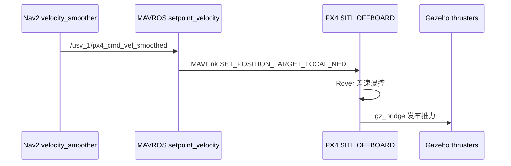

```bash
ros2 launch mavros px4.launch fcu_url:=udp://@127.0.0.1:14540
ros2 service call /mavros/set_mode mavros_msgs/srv/SetMode "{custom_mode: 'OFFBOARD'}"
```

---

## 八、全栈启动编排与数据流

### 8.1 Launch 启动顺序

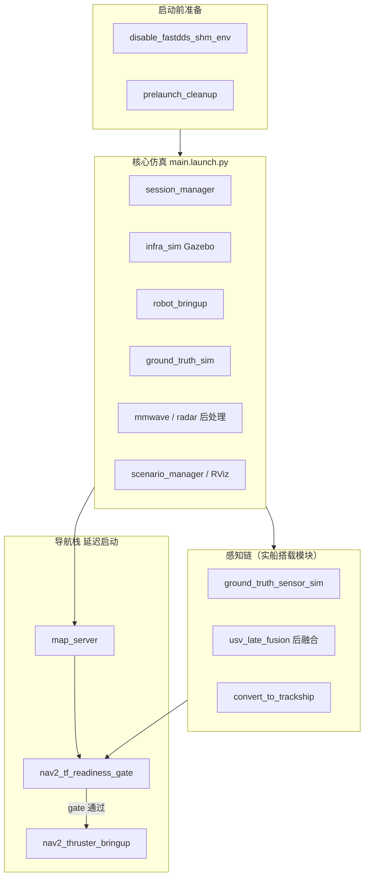

### 8.2 完整数据流总览

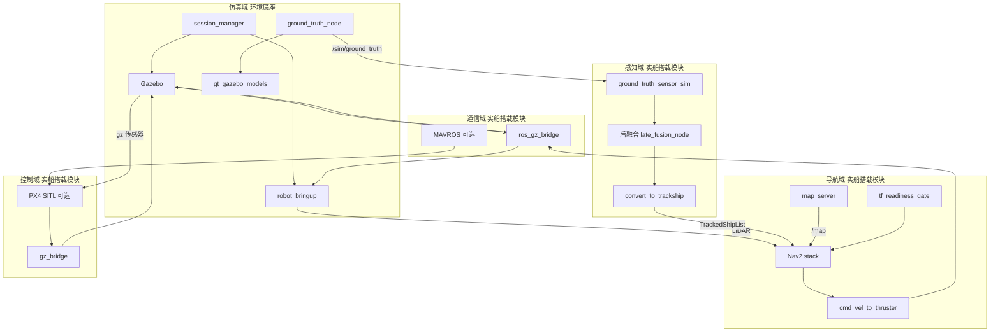

### 8.3 双轨感知设计小结

1. **Gazebo 物理轨**（仿真域）：本船动力学 + 传感器 raw 数据生成，服务 Nav2 **局部避障**与可视化。
2. **真值感知轨**（仿真域供给输入 → 感知域实船模块处理）：周邻目标真值 → `ground_truth_sensor_sim`（仿真替代真实检测）→ **后融合**（实船算法）→ `TrackedShipList`，服务 **远程周邻船避碰（COLREGs costmap）**。实船上线后仅将 `ground_truth_sensor_sim` 替换为真实检测节点，后融合与下游接口不变。

---

## 九、主要 ROS 话题一览

| 话题 | 类型 | 生产者 | 消费者 |
|------|------|--------|--------|
| `/sim/ground_truth` | GlobalTrackArray | `scenario_ground_truth_gazebo_entity` 或 `scenario_ground_truth_node` | `sim_vision_*`, `sim_mmwave_front` |
| `/vision/{front,left,right}/detections` | VisionDetectionArray | ground_truth_sensor_sim | late_fusion_node |
| `/mmwave/front/targets` | MmwaveTargetArray | ground_truth_sensor_sim | late_fusion_node |
| `/fusion/snapshot` | FusedSceneSnapshot | late_fusion_node（后融合） | convert_to_trackship |
| `/fusion/tracks` | — | late_fusion_node | RViz / 调试 |
| `/tracked_ship` | TrackedShipList | convert_to_trackship | Nav2 TSProjectionLayer |
| `/usv_1/odom` | Odometry | Gazebo bridge | TF、Nav2、融合参考 |
| `/usv_1/sensors/lidar/front_lidar/points` | PointCloud2 | Gazebo | Nav2 obstacle_layer |
| `/map` | OccupancyGrid | map_server | Nav2 static_layer |
| `/usv_1/cmd_vel` | Twist | Nav2 controller | cmd_vel_to_thruster |
| `/usv_1/px4_cmd_vel_smoothed` | Twist | Nav2（路径 C） | MAVROS setpoint_velocity |
| `/usv_1/thrusters/{left,right}/thrust` | Float64 | cmd_vel_to_thruster 或 PX4 | Gazebo 推进器 |
| `/mavros/state` | State | MAVROS | 飞控状态监控 |

---

## 十、可开关模块（Launch 参数）

| 分类 | 参数 | 默认值 | 说明 |
|------|------|--------|------|
| 仿真 | `enable_robot_localization` | `false` | EKF 定位 |
| 仿真 | `use_static_map_odom_tf` | `true` | 发布 map→odom 静态 TF |
| 仿真 | `enable_tf_namespace_relay` | `true` | 命名空间 TF 中继 |
| 仿真 | `gz_headless` | `false` | 无 GUI 模式 |
| 感知 | `enable_gt_sensor_sim` | `true` | 真值感知仿真 |
| 感知 | `enable_late_fusion` | `true` | 后融合 |
| 感知 | `enable_convert_to_trackship` | `true` | 后融合→Nav2 目标转换 |
| 导航 | `enable_nav2` | `true` | Nav2 导航栈 |
| 导航 | `nav2_namespace` | `auto` | 自动取首船名 |
| 导航 | `nav2_start_on_gate_failure` | `false` | gate 失败时强制启动 |
| 运维 | `auto_cleanup` | `true` | 启动前清理残留进程 |
| 运维 | `disable_fastdds_shm` | `true` | 禁用 FastDDS 共享内存 |

---

## 十一、典型启动与验证

### 11.1 全栈一键启动（路径 A：ROS 控制）

```bash
source install/setup.bash

ros2 launch usv_sim_full nav2_sim_three_vision_mmwave_bringup.launch.py
ros2 launch usv_sim_full nav2_sim_three_vision_mmwave_bringup.launch.py enable_nav2:=false
ros2 launch usv_sim_full nav2_sim_three_vision_mmwave_bringup.launch.py gz_headless:=true
```

### 11.2 船级社认证场景启动

```bash
ros2 launch usv_sim_full certifi_launch.launch.py \
  case_config:=src/usv_simulation/usv_sim_full/config/certificate_case/C1-001.yaml
```

### 11.3 PX4 固件联调（路径 B）

```bash
# 终端 1
ros2 launch usv_sim_full main.launch.py

# 终端 2
cd src/usv_simulation/third_party/PX4-Autopilot
PX4_GZ_STANDALONE=1 PX4_GZ_WORLD=sydney_regatta \
PX4_SYS_AUTOSTART=50000 PX4_SIM_MODEL=gz_rover_differential \
./build/px4_sitl_default/bin/px4
```

### 11.4 健康检查

```bash
ros2 topic echo /sim/ground_truth --once
ros2 topic hz /fusion/snapshot
ros2 topic echo /tracked_ship --once
ros2 run tf2_ros tf2_echo map usv_1/base_link
```

---

## 十二、相关文件索引

| 路径 | 说明 |
|------|------|
| `launch/nav2_sim_three_vision_mmwave_bringup.launch.py` | 全栈入口 Launch |
| `launch/certifi_launch.launch.py` | 船级社认证场景 Launch |
| `launch/main.launch.py` | 核心仿真主入口 |
| `launch/nav2_thruster_bringup.launch.py` | Nav2 + cmd_vel→推进器 |
| `config/three_vision_one_mmwave/full_config.yaml` | 整机与场景配置 |
| `config/certificate_case/*.yaml` | 认证会遇场景案例（41 个） |
| `config/certificate_case/README.md` | 认证场景说明 |
| `config/certi_senario.yaml` | 认证仿真基底配置 |
| `tools/generate_certificate_cases.py` | 认证场景批量生成 |
| `tools/merge_certi_config.py` | 认证场景合并工具 |
| `config/radar_nav2_param.yaml` | Nav2 costmap 与控制器参数 |
| `usv_late_fusion/config/event_fusion_three_sensor_io.yaml` | 后融合 I/O |
| `usv_late_fusion/config/event_fusion_algorithm.yaml` | 后融合算法参数 |
| `third_party/PX4-Autopilot/README.usv.md` | PX4 工作区集成说明 |
| `third_party/PX4-Autopilot/usage.md` | PX4 联调步骤手册 |
| `usv_comm/mavros/mavros/launch/px4.launch` | MAVROS 启动文件 |

---

## 十三、建设进展与后续方向

| 方向 | 当前状态 | 说明 |
|------|----------|------|
| 全栈仿真一键启动 | 已完成 | `nav2_sim_three_vision_mmwave_bringup.launch.py` |
| YAML 模块化配置 | 已完成 | 五大域均可独立调节 |
| PX4 gz_bridge 对接 | 已完成 | 传感器/执行器与 `usv_1` 对齐 |
| 船级社认证场景案例库 | **建设中** | 41 个会遇局面 YAML + `certifi_launch` |
| 认证场景 + 后融合 + Nav2 联合评测 | 规划中 | 将 COLREGs costmap 接入认证流程 |
| PX4 + Nav2 一键 Launch | 规划中 | 当前需多终端手动启动 |
| `usv_mavlink_bridge` 统一 Autopilot 接口 | 骨架已建 | 源码待实现 |
| 实船感知算法替换仿真感知节点 | 规划中 | 保持后融合接口不变 |
