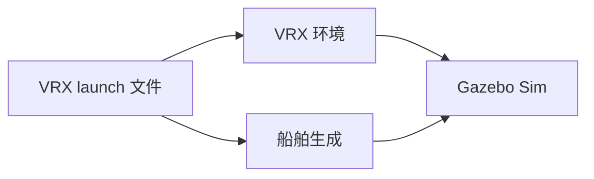

# 功能包架构

本包组织 VRX 的 Gazebo 启动文件，并依赖 `vrx_ros` 和 `wamv_gazebo`。

```mermaid
flowchart LR
    LAUNCH[VRX launch 文件] --> ENV[VRX 环境]
    LAUNCH --> SPAWN[船舶生成]
    ENV --> GZ[Gazebo Sim]
    SPAWN --> GZ
```

主要启动文件位于 `launch/`，包括环境、生成和竞赛入口。
