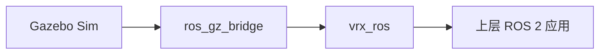

# 功能包架构

本包为 VRX 的 ROS 资源包，向 `vrx_gz` 和上层仿真包提供消息、节点和启动资源。

```mermaid
flowchart LR
    GZ[Gazebo Sim] --> BRIDGE[ros_gz_bridge]
    BRIDGE --> VRXROS[vrx_ros]
    VRXROS --> APP[上层 ROS 2 应用]
```

`launch/monitor_sim.py` 可用于监视 Gazebo 仿真进程。
