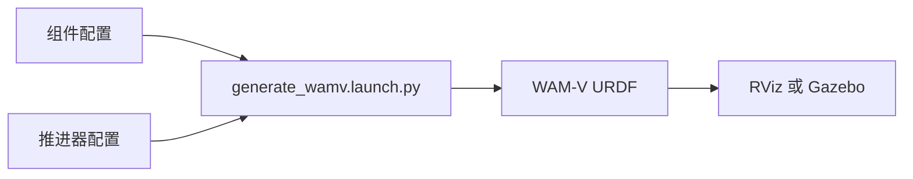

# 功能包架构

本包组织 WAM-V 的组件、推进器和 Xacro 生成资源。

```mermaid
flowchart LR
    COMPONENTS[组件配置] --> GENERATE[generate_wamv.launch.py]
    THRUSTERS[推进器配置] --> GENERATE
    GENERATE --> URDF[WAM-V URDF]
    URDF --> RVIZ[RViz 或 Gazebo]
```

`generate_wamv.launch.py` 读取组件和推进器配置，生成可供下游使用的船舶描述。
