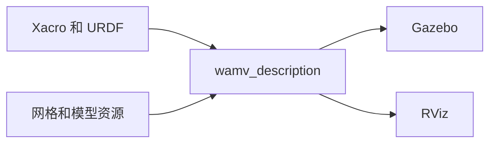

# 功能包架构

本包为船舶描述资源包，不包含运行节点。

```mermaid
flowchart LR
    XACRO[Xacro 和 URDF] --> DESCRIPTION[wamv_description]
    MESH[网格和模型资源] --> DESCRIPTION
    DESCRIPTION --> GZ[Gazebo]
    DESCRIPTION --> RVIZ[RViz]
```

下游包使用本包的描述文件和模型资源生成或显示 WAM-V。
