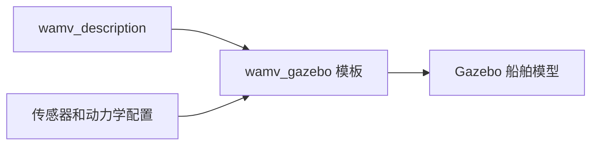

# 功能包架构

本包在 `wamv_description` 的基础上提供 Gazebo 模型模板、传感器和动力学配置。

```mermaid
flowchart LR
    DESCRIPTION[wamv_description] --> TEMPLATES[wamv_gazebo 模板]
    TEMPLATES --> GZ[Gazebo 船舶模型]
    CONFIG[传感器和动力学配置] --> TEMPLATES
```

下游 launch 文件根据模板和配置创建可仿真的 WAM-V 实体。
